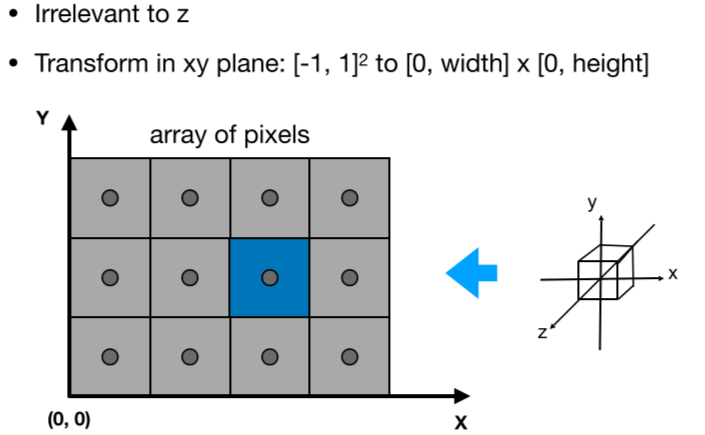

[TOC]

# Lecture01. Overview of Computer Graphics

画面的明亮程度可以成为评判游戏画面好坏的标准。特效最难的点在于经常看到的东西。主要讲的内容：

- 光栅化
- 几何形体
- 光线追踪
- 动画和模拟


不包括API、建模、引擎使用、CV等。CV和图形学的区别：


# Lecture02. Review of Linear Algebra

图形学依赖于：


- 基础数学：线性代数、微积分、统计
- 基础物理：光学、机械
- 其他：信号处理、数值分析
- 美学

## 叉乘

叉乘可以判定左和右，还可以判定内与外。


左图中，可以通过对向量$\vec a$和$\vec b$做叉乘，判断$\vec b$在$\vec a$的左侧还是右侧，如果叉乘结果是正向量，说明在左侧。

## 矩阵


# Lecture03. Transformation

## Why study transformation

### 1. Modeling 模型变换

移动相机视野中的3D模型的变换；模型移动过程中的旋转变换；模型的缩放变换

### 2. Viewing 视图变换

从3D模型转换成2D的图片


## 2D transformation


缩放变换：


镜像变换：


切变：


底边不动，$y=1$的位置移动$a$。

旋转变换：


令$(x,y)=(1,0),(0,1)$带入变换即可得到旋转公式。旋转矩阵$R_{\theta}$是正交阵

上述变换都可以写成矩阵乘向量的形式：


这种变换就线性变换。

## Homogeneous coordinates 齐次坐标系

上面的变换形式无法套用到平移变换中：


为此我们要引入齐次坐标系。将原来2维的向量扩充一维，加入齐次项，对二维的点加入一个齐次项1，二维的向量加入齐次项0：


这样平移变换可以写成矩阵形式：


为什么点增加的是1，向量增加的是0呢？因为向量具有平移不变性，它表示的是一个方向，所以平移不应该改变它的指向。更进一步有：


齐次坐标中规定，只要第三个齐次项$\omega$不为0，都可以化成标准形式。其中point+point的结果还是一个点，表示的是两点的中点。

### 1. Affine Transformation


在表示仿射变换的时候，变换矩阵的最后一行始终是001.

### 2. Inverse Transform

变换矩阵的逆矩阵就是逆变换。

### 3. Composing Transforms

多个变换叠加就是多个矩阵相乘：


最后的变换在最左边。

### 4. Decomposing Complex Transforms

可以将矩阵的变换进行分解：


以上图为例，想要实现以$c$点为中心的旋转，我们可以将图片整个沿$-c$的方向移动到原点，采用变换矩阵$T(-c)$，然后旋转一个角度，再沿着$c$方向移动回去即可。

## 3D Transformation

类似二维变换，三维情况再加一个齐次坐标即可：


# Lecture04. Transformation Cont.

## 3D Transformations

绕轴旋转：


为什么Y轴是转置的。因为按照叉乘的规律，$z\times x=y$，而不是$x \times z$。

任意三维空间的旋转可以写成绕三个坐标轴旋转的组合：


罗德里格斯旋转公式：


## Viewing Transformation(观测变换)MVP

### 1. View(视图)/Camera transformation

首先定义相机，包括位置、朝向、上方向。向上方向为了明确相机的旋转（俯仰角度）：


我们约定俗成固定相机在原点，沿着-z方向看，上方向是y轴正方向。在设定场景的时候需要把相机放到约定俗成的位置，这里涉及到一个变换$M_{view}$：


变换过程如下：


难点在求旋转矩阵上，直接将某个轴旋转到标准轴不好求，可以先求逆，让标准轴旋转到当前轴的位置。然后求逆矩阵。

### 2. Projection(投影) transformation

正交投影不会近大远小，透视投影则会。


#### Orthographic projection（正交投影）

将摄像机摆到指定位置后，将Z轴去掉，就得到了正交投影：


也可以认为相机是无限远。

正交投影的过程是将空间中的物体映射到标准视体（边长为2，中心在原点的立方体）中，具体做法是先平移后缩放：


#### Perspective projection（透视投影）


透视投影，近大远小，平行线不平行，汇聚到一点。透视投影中用到了齐次坐标，对于一个三维空间中的点加入了齐次坐标后具有一个性质：乘以一个$k$后代表的点不变。


透视投影的过程就是首先将一个视锥变成一个立方体，然后对这个正方体做正交投影：


首先是第一步，如何将视锥变成立方体，注意到视锥中的物体的$y$坐标如果放在右手系中是和$z$轴成比例的，也就是说离原点越远$y$的值越大，对于$x$坐标也是如此。


同理对于$x$有$x'=\frac nz x$。现在我们知道了$x,y$如何变换，也就是坐标$(x,y,z,1)$怎么样从视锥中变到立方体，但是对于$z$怎么变换还不知道：


现在要解决第三行是什么的问题。从图7.13可以看出，在近平面$n$，和远平面$f$中的$z$值是不变的。也就是当$z=n,z=f$时，矩阵变换后得到的还是$n,f$。还有一个结论是，在近平面$n$上的所有点坐标都是不变的。将$z=n$带入点的坐标然后做变换：


将变换得到的结果在同乘以$n$，这样可以看出，第三行和$(nx,ny,n^2,n)$相乘，得到的结果是$n^2$，也就是和$x,y$都没有关系，所以第三行前两个分量一定是0：


又因为在$f$平面上做变换$z$也是不变的，所以这样就有了两个方程：


解出$A,B$得到的结果是：
$$
\begin{align}
A &= n+f \\
B &= -nf
\end{align}
$$
这样就得到了变换矩阵$M_{pto}$：
$$
M_{pto}=\begin{pmatrix}
n & 0 & 0 & 0\\
0 & n & 0 & 0\\
0 & 0 & n+f & -nf \\
0 & 0 & 0 & 1
\end{pmatrix}
$$
得到了透视投影的变换矩阵后就能完整构建出透视投影到正交投影的矩阵集：
$$
M_p=M_oM_{pto}
$$

# Lecture05. Rasterization 1(Triangles)

## Perspective Projection

可以通过长宽比（aspect ratio）和垂直可视角度（fovY）来定义视锥。


通过这种方式定义的视锥可以转化成上节课说的通过6面体定义的视锥：


至此说完了MVP变换：


后面我们就需要将标准视体转换到屏幕进行显示。

## Canonical Cube to Screen


首先定义屏幕空间，这里和虎书略有不同，边界像素不是在坐标轴上，也就是初始像素中心是$(0.5,0.5)$而不是$(0,0)$，像素坐标不是整数：


现在我们要做的就是将标准视体转换到屏幕上，$z$先丢掉：



可以直接先将$[-1,1]\times [-1,1]$转换到$[0,width]\times [0,height]$，也就是之前说的视口变换：


下一步就要将图像显示为像素。

## Different Raster Displays

示波器、阴极射线管（隔行扫描）。帧缓存，将内存用于缓存显示图像：


现代的主流显示设备是平板显示：


液晶通过自身排布影响光的极化（偏振）。此外还有LED显示、电泳显示（墨水屏）。

## Rasterization

三角形是最基础的多边形，还可以将其他形状拆成三角形，解决了绘制三角形的问题，其他形状的绘制也就解决了。此外三角形还有一些独特的性质：

- 三角形保证在一个平面上，便于绘制
- 三角形内外边界比较明确
- 三角形只需要定义了三个顶点的属性，在三角形内部可以根据顶点的属性进行渐变（插值）

下面就要解决像素绘制的问题，在显示三角形的时候如何决定内部像素和边界像素是否显示？答案就是采样。采样就是将连续的函数离散化（相当于在对应的位置取点而不是绘制整个函数曲线）：


可以定义一个函数判断像素中心是否在三角形内部，是的话就显示像素。


所以光栅化的过程就是使用这个函数决定图像是否显示：

```c++
for (int x = 0; x < xmax; ++x)
    for (int y = 0; y < ymax; ++y)
        image[x][y] = inside(tri, x+0.5, y+0.5)
```

判断是否在三角形内部可以通过3个向量的叉积，如果像素中心在边界上，可以选择画或者不画，如果是在两个三角形的相邻边，可以通过屏幕上固定的一点（通常选$(-1,-1)$）和三角形非公边顶点是否在一边来选择是否绘制。

上面的算法中为了绘制图像要将屏幕上所有点都遍历一遍是没有必要的，可以使用Bounding Box来框住三角形只遍历我们需要的部分：


## Rasterization on Real Displays


可以看出像素排列的不同。

我们采用上述方法绘制出来三角形后，会存在锯齿和失真：


这就需要抗锯齿技术。

# Lecture06. Rasterization 2(Antialiasing and Z-Buffering)

## Antialiasing

如上图，像素画成的三角形很不规则，不符合实际。

### 1. Sampling is Ubiquitous in Computer Graphics

光栅化的过程也是一种采样的过程，像素是离散的，图象是连续的。视频也是一系列离散的图片组成的。

### 2. Sampling Artifacts(Errors/Mistakes/Inaccuracies) in Computer graphics

采样会产生一系列的失真和错误，例如锯齿、摩尔纹：


导致这些失真现象的原因就是：信号变化的很快而采样速度太慢。

### 3. Antialiasing Idea: Blurring（Pre-Filtering) Before Sampling

解决问题的一个思路就是在采样之前先进行一次滤波（模糊化处理）。


滤波和采样的顺序不能颠倒，为什么呢？

### 4. Frequency Domain（频域）

正弦波和余弦波的频率：


**傅里叶变换：**

将函数表示为一系列正弦和余弦函数的组合即傅里叶展开。傅里叶变换：


将不同频率的余弦波累加到函数上，可以逼近函数。如上图所示。


所谓的傅里叶变换就是将函数分解成不同频率的段然后进行积分累加。

假设我们有不同频率的5个函数，使用相同的频率对其进行采样：


发现对低频的函数，采样过后的函数可以较好的表示，但是对于高频函数而言，就很不准确了。这表明欠采样会造成频率走样，对于两个频率截然不同的函数而言，如果采用同样的采样率，会导致产生相同的结果：


### 3. Filtering

滤波就是去除信号中某些频率。傅里叶变换从实域变到频域。我们将图像中心定义为低频域（大片色块，颜色变化缓慢），图像（轮廓）定义为高频域（导数大，也就是色彩变化剧烈，通常在边界处），那么通过傅里叶变换，可以得到特定频率的图像：


### 4. Convolution

滤波其实就是卷积的过程，是对图像局部进行平均的过程，也就是局部特征的提取。


卷积定理：实域上两个信号的卷积是频域上两个信号的乘积，如下图中Option1和Option2是等价的：


上图中下面一行就是将频域上的两个图像直接相乘，然后得到结果。

### 5. Sampling = Repeating Frequency Contents


(a)是一个连续函数，(b)是其傅里叶变换后的结果（频域），然后对(a)进行采样（直接用(a)函数乘以(c)，(c)也叫冲激函数）。最后得到的(f)就是频域上的卷积结果，可以看出采样就是重复原始信号的频谱。

那么可以解释走样的原因，就是采样的过程中混合了不同频率的内容：


正常采样为上图，非正常采样会让不同的频谱混在一起。

### 6. Antialiasing


增加采样率：

- 在频域提升采样距离
- 提升分辨率，也就是增加像素数，提高采样率

反锯齿：

- 先过滤高频信息，然后再采样


如上图，先过滤掉高频信号，方框外认为是高频，过滤掉之后再采样，对应上图就没有了混在一起的频率，也就没有了走样。

### 7. A Practical Pre-Filter


用一个像素大小的卷积核，对三角形做卷积，根据三角形在像素中占的比例来决定输出的灰度，但是如何计算三角形在**一个像素**中的占比呢？三角形一个边无法占据多个像素，所以可以用超级采样的方法，先提升分辨率再降采样。

### 8. Antialiasing By Supersampling(MSAA)

将像素进一步划分，划成多个小像素，然后将判断结果（三角形占像素的比例）平均。


如上三图，解释了这个过程，MSAA只是解决了反走样中的模糊操作的问题，而采样是隐含在结果中的：


MSAA增大了计算量，多少倍就增加了多少计算量。

## Visibility/Occlusion