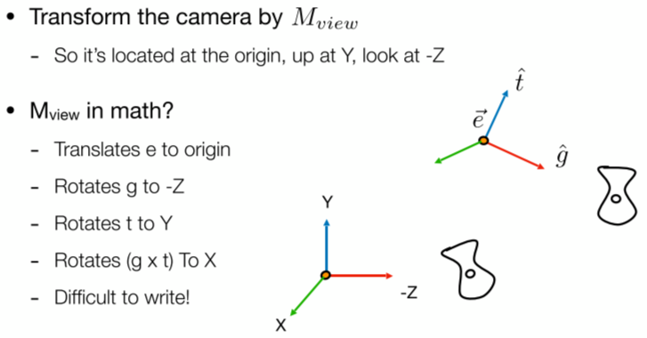

[TOC]

# Lecture01. Overview of Computer Graphics

画面的明亮程度可以成为评判游戏画面好坏的标准。特效最难的点在于经常看到的东西。主要讲的内容：

- 光栅化
- 几何形体
- 光线追踪
- 动画和模拟

不包括API、建模、引擎使用、CV等。CV和图形学的区别：

# Lecture02. Review of Linear Algebra

图形学依赖于：

- 基础数学：线性代数、微积分、统计
- 基础物理：光学、机械
- 其他：信号处理、数值分析
- 美学

## 叉乘

叉乘可以判定左和右，还可以判定内与外。

左图中，可以通过对向量$\vec a$和$\vec b$做叉乘，判断$\vec b$在$\vec a$的左侧还是右侧，如果叉乘结果是正向量，说明在左侧。

## 矩阵

# Lecture03. Transformation

## Why study transformation

### 1. Modeling 模型变换

移动相机视野中的3D模型的变换；模型移动过程中的旋转变换；模型的缩放变换

### 2. Viewing 视图变换

从3D模型转换成2D的图片

## 2D transformation

缩放变换：

镜像变换：

切变：

底边不动，$y=1$的位置移动$a$。

旋转变换：

令$(x,y)=(1,0),(0,1)$带入变换即可得到旋转公式。旋转矩阵$R_{\theta}$是正交阵

上述变换都可以写成矩阵乘向量的形式：

这种变换就线性变换。

## Homogeneous coordinates 齐次坐标系

上面的变换形式无法套用到平移变换中：

为此我们要引入齐次坐标系。将原来2维的向量扩充一维，加入齐次项，对二维的点加入一个齐次项1，二维的向量加入齐次项0：

这样平移变换可以写成矩阵形式：

为什么点增加的是1，向量增加的是0呢？因为向量具有平移不变性，它表示的是一个方向，所以平移不应该改变它的指向。更进一步有：

齐次坐标中规定，只要第三个齐次项$\omega$不为0，都可以化成标准形式。其中point+point的结果还是一个点，表示的是两点的中点。

### 1. Affine Transformation

在表示仿射变换的时候，变换矩阵的最后一行始终是001.

### 2. Inverse Transform

变换矩阵的逆矩阵就是逆变换。

### 3. Composing Transforms

多个变换叠加就是多个矩阵相乘：

最后的变换在最左边。

### 4. Decomposing Complex Transforms

可以将矩阵的变换进行分解：

以上图为例，想要实现以$c$点为中心的旋转，我们可以将图片整个沿$-c$的方向移动到原点，采用变换矩阵$T(-c)$，然后旋转一个角度，再沿着$c$方向移动回去即可。

## 3D Transformation

类似二维变换，三维情况再加一个齐次坐标即可：

# Lecture04. Transformation Cont.

## 3D Transformations

绕轴旋转：

为什么Y轴是转置的。因为按照叉乘的规律，$z\times x=y$，而不是$x \times z$。

任意三维空间的旋转可以写成绕三个坐标轴旋转的组合：

罗德里格斯旋转公式：

## Viewing Transformation(观测变换)MVP

### 1. View(视图)/Camera transformation

首先定义相机，包括位置、朝向、上方向。向上方向为了明确相机的旋转（俯仰角度）：

我们约定俗成固定相机在原点，沿着-z方向看，上方向是y轴正方向。在设定场景的时候需要把相机放到约定俗成的位置，这里涉及到一个变换$M_{view}$：

变换过程如下：

难点在求旋转矩阵上，直接将某个轴旋转到标准轴不好求，可以先求逆，让标准轴旋转到当前轴的位置。然后求逆矩阵。

### 2. Projection(投影) transformation

正交投影不会近大远小，透视投影则会。

#### Orthographic projection（正交投影）

将摄像机摆到指定位置后，将Z轴去掉，就得到了正交投影：

#### Perspective projection（透视投影）