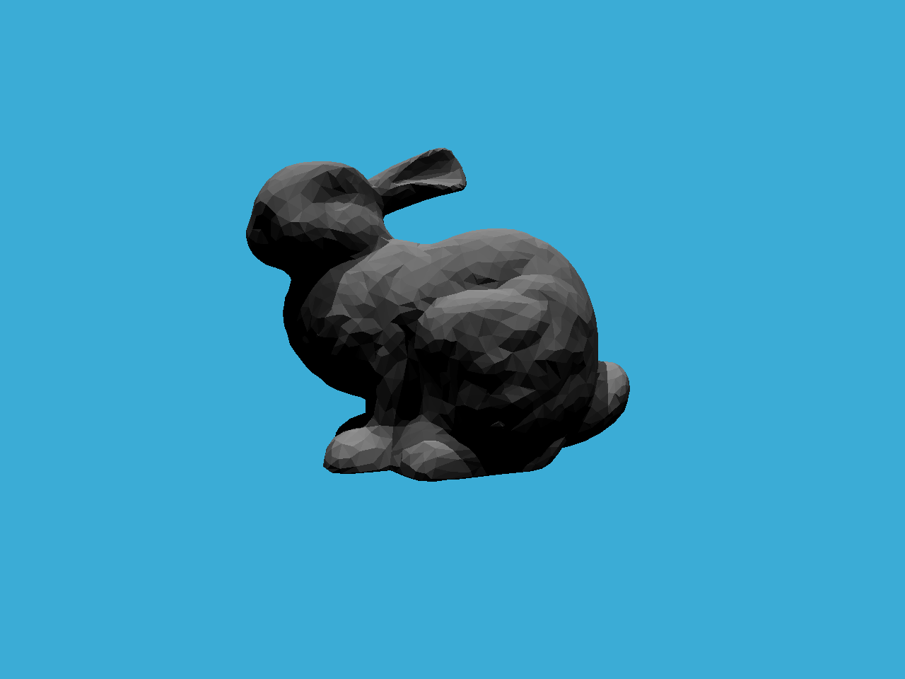

[TOC]

# Assignment00. 旋转点

此次作业采用Eigen线性代数运算库进行空间中点和向量的运算。

最基础的向量表示：`Eigen::Vector3f v(1.0f, 2.0f, 3.0f)`，向量之间加减数乘按照普通规则来，矩阵表示如下：

```c++
// Example of matrix
std::cout << "Example of matrix \n";
// matrix definition
Eigen::Matrix3f i,j;
i << 1.0, 2.0, 3.0, 4.0, 5.0, 6.0, 7.0, 8.0, 9.0;
j << 2.0, 3.0, 1.0, 4.0, 6.0, 5.0, 9.0, 7.0, 8.0;
```

`Matrix3f`表示一个$3\times 3$的矩阵。

作业内容是：

给定一个点 $P=(2,1)$，将该点绕原点先逆时针旋转$45^\circ$，再平移$ (1,2)$, 计算出 变换后点的坐标（要求用齐次坐标进行计算）。

首先要声明一个三维向量，包含一维的齐次坐标。按照课程中的方法，旋转变换和平移变换可以用矩阵的乘积表示，如下：
$$
R = R_t*R_\theta = 
\begin{bmatrix}
1 & 0 & t_x \\
0 & 1 & t_y \\
0 & 0 & 0
\end{bmatrix}

\begin{bmatrix}
\cos\theta & -\sin\theta & 0 \\
\sin\theta & \cos\theta & 0 \\
0 & 0 & 1
\end{bmatrix}
$$
所以只要计算出$R$，并左乘向量$P=(2,1)$即可：
$$
R = 
\begin{bmatrix}
1 & 0 & 1 \\
0 & 1 & 2 \\
0 & 0 & 1
\end{bmatrix}
\begin{bmatrix}
\frac{\sqrt 2}{2} & -\frac{\sqrt 2}{2} & 0 \\
\frac{\sqrt 2}{2} & \frac{\sqrt 2}{2} & 0 \\
0 & 0 & 1
\end{bmatrix}=
\begin{bmatrix}
\frac{\sqrt 2}{2} & -\frac{\sqrt 2}{2} & 1 \\
\frac{\sqrt 2}{2} & \frac{\sqrt 2}{2} & 2 \\
0 & 0 & 1
\end{bmatrix}
$$
写出程序：

```c++
double torad(const float a) {
    return a * M_PI / 180;
}

int main(){
    Eigen::Vector3f P(2, 1, 1);
    Eigen::Matrix3f R;
	// 需要将角度转换成弧度才能用C++自带的库函数，此外C++中用M_PI表示PI
    R << cos(torad(45)), -sin(torad(45)), 1,
         sin(torad(45)),  cos(torad(45)), 2,
         0,              0,               1;
    cout << "Rotation and Translation of P(2,1): " << endl;
    cout << R * P << endl;

    return 0;
}
```


也可以用Eigen自带的库函数，Eigen自带了旋转函数，在Sapce Transformation中可以查到：

```c++
int main(){
    Vector3f P(2, 1, 1);

    Rotation2Df r(M_PI / 4);	// 构造2维旋转矩阵
    Translation2f t(1, 2);		// 构造平移向量

    Matrix3f rot;				// 最终生成的变换矩阵
    rot.setIdentity();			// 初始化为单位阵
    // block<NRows, NCols>(startRow, startCol);
    rot.block<2, 2>(0, 0) = r.toRotationMatrix();		// 填充旋转矩阵
    rot.block<2, 1>(0, 2) = t.translation();			// 填充平移矩阵

    cout << rot * P << endl;
    
    return 0;
}
```


输出是一样的。这里要注意的就是各类矩阵的类型，一般来说使用浮点型，也就是后缀是f，类型不匹配会报错。Eigen中的旋转有角轴旋转（3D），四元数旋转（3D），旋转矩阵（2D&3D）。这里使用的旋转矩阵方法。具体参见链接：[Eigen使用笔记](http://zhaoxuhui.top/blog/2019/09/03/eigen-note-4.html#12d旋转)

# Assignment01. 旋转与投影

填写一个旋转矩阵和透视投影矩阵，实现对图像的旋转和透视操作。复习一下MVP变换。

https://blog.csdn.net/junzia/article/details/85939783

## Model矩阵

Model矩阵用于模型在模型空间中的转换（一般模型空间是右手系），是无限大的一个空间。Model矩阵隐含了旋转、平移、缩放三种变换。旋转包含三个方向的旋转：
$$
\begin{align}
&\begin{bmatrix}
1 & 0 & 0 & 0\\
0 & \cos\alpha & -\sin\alpha & 0\\
0 & \sin\alpha & \cos\alpha & 0 \\
0 & 0 & 0 & 1
\end{bmatrix} \quad 绕X轴旋转 \\ \\
&\begin{bmatrix}
\cos\beta & 0 & \sin\beta & 0\\
0 & 1 & 0 & 0\\
-\sin\beta & 0 & \cos\beta & 0 \\
0 & 0 & 0 & 1
\end{bmatrix} \quad 绕Y轴旋转 \\ \\
&\begin{bmatrix}
\cos\gamma & -\sin\gamma & 0 & 0\\
\sin\gamma & \cos\gamma & 0 & 0\\
0 & 0 & 1 & 0 \\
0 & 0 & 0 & 1
\end{bmatrix} \quad 绕Z轴旋转
\end{align}
$$

## View矩阵

View矩阵是观察者方向相对物体位置变化时用于描述对应变化的矩阵。观察者相对物体的位置变化也可以采用物体自身的变化来描述，可以用Model矩阵来描述，因为运动是相对的。

View矩阵的作用是将模型从模型世界的坐标系中转换到相对相机的观察坐标系中。相机的位置、观察的方向和相机向上的向量共同构成了观察坐标系，View矩阵就是将物体从模型坐标系变换到观察坐标系。

从世界坐标变换到相机空间坐标，一般有两步：

- 首先将世界坐标的基旋转到和相机空间基重合的位置，实际上就是从一个向量空间到另一个向量空间的变换，求出过渡矩阵即可：
  $$
  R = \begin{bmatrix}
  u_x & u_y & u_z & 0 \\
  v_x & v_y & v_z & 0 \\
  w_x & w_y & w_z & 0 \\
  0 & 0 & 0 & 1
  \end{bmatrix}
  $$
  这就是旋转矩阵。

- 然后将世界坐标平移到相机坐标的原点，由此可以得到旋转矩阵：
  $$
  T = \begin{bmatrix}
  1 & 0 & 0 & -t_x \\
  0 & 1 & 0 & -t_y \\
  0 & 0 & 1 & -t_z \\
  0 & 0 & 0 & 1
  \end{bmatrix}
  $$
  

## Projection矩阵

投影矩阵用于将相机空间转换到裁剪空间。因为屏幕不是无限大的。包括正交投影和透视投影。

### 正交投影

正交投影中$x,y$轴坐标不变，直接将$z$轴坐标去除。假设点$P(x,y,z)$经过model和view变换后得到$P_1(x_1, y_1, z_1)$，$P_1$经过正交投影变换得到$P_2(x_2,y_2,z_2)$，点$P_2$的$x,y,z$分量都在$[-1,1]$之间，因为正交投影变换是将点映射到标准视体（中心在原点，边长为2的立方体）中。

正交投影矩阵有六个参数，即待投影空间的范围，上平面$t$，下平面$b$，左平面$l$，右平面$r$，近平面$n$，远平面$f$。投影的过程是将待投影空间变换到标准视体的过程，标准视体是$[-1,1]\times [-1,1]\times [-1,1]$的一个范围，所以变换的过程就包括平移和缩放两个过程。包含两个矩阵：
$$
\begin{bmatrix}
x_{can} \\ y_{can} \\ z_{can} \\ 1 
\end{bmatrix}=\begin{bmatrix}
\frac{2}{r-l} & 0 & 0 & 0 \\
0 & \frac{2}{t-b} & 0 & 0 \\
0 & 0 & \frac{2}{n-f} & 0 \\
0 & 0 & 0 & 1
\end{bmatrix} \begin{bmatrix}
1 & 0 & 0 & -\frac{l+r}2 \\
0 & 1 & 0 & -\frac{t+b}2 \\
1 & 0 & 1 & -\frac{n+f}2 \\
0 & 0 & 0 & 1
\end{bmatrix} \begin{bmatrix} x \\ y \\ z \\1 \end{bmatrix}
 = M_oP
$$

### 透视投影

透视投影的作用就是将一个视锥（符和近大远小）转换成一个标准视体，需要先转换成正交投影，然后再变换到标准视体。输入参数有4个，广角fov（fovx或fovy）、宽高比aspect，近平面n，远平面f。采用这种方式定义时：


如图，可以得到透视投影转换成正交投影后，正交投影的范围$l,r,t,b,n,f$之间的关系：
$$
-l = r, aspect = \frac rt\\ -b=t, \tan\frac{fovY}{2} = \frac t{|n|} \\
$$
其中$n,f$已知，所以我们就能根据输入参数构建$M_o$，然后乘以透视矩阵$M_p$。$M_p$的过程是将视锥压缩成平行六面体（就是正交投影前的那个）。注意到视锥中物体的$y$坐标是和$z$成比例的：


同理对于$x$有$x'=\frac nz x$。现在我们知道了$x,y$如何变换，也就是坐标$(x,y,z,1)$怎么样从视锥中变到立方体：


$$
M_p\begin{bmatrix} x \\ y \\ z \\ 1 \end{bmatrix} =
\begin{bmatrix}
nx/z \\ ny/z \\ ? \\ 1
\end{bmatrix} = 
\begin{bmatrix}
nx \\ ny \\ ? \\ z
\end{bmatrix}
$$
现在未知的是$z$如何变化，根据上面的结果可以构造一个矩阵如下：
$$
M_p = \begin{bmatrix}
n & 0 & 0 & 0 \\
0 & n & 0 & 0 \\
? & ? & ? & ? \\
0 & 0 & 1 & 0 
\end{bmatrix}
$$
第三行是未知的，可以带入特殊点进行验证。首先在近平面的所有点的坐标是不会发生变化的，即$M_pP_n = P_n$，也就是当$z=n$时，坐标点不发生变化。此外远平面上所有点的$z$坐标也不会发生变化，即$z = f$时，坐标点的第三个分量不变。

首先，当$z=n$时，点$(x,y,n,1)$经过变换还是$(x,y,n,1)$，同乘以$n$，得到$(nx,ny,n^2,n)$，假设：
$$
M_p = \begin{bmatrix}
n & 0 & 0 & 0 \\
0 & n & 0 & 0 \\
a & b & c & d \\
0 & 0 & 1 & 0
\end{bmatrix}
$$
对比变换结果，因为$n^2 = ax+by+cn+d$，可得$a = b = 0$。

然后根据第二点，远平面上$z$坐标不变，$(x,y,f,1)$经过变换后为$(nx,ny,f,1)$，同乘以$f$，得到$(nfx,nfy,f^2,f)$，即$cf +d = f^2$，结合上面得式子：
$$
\begin{cases}
cn+d=n^2 \\
cf+d=f^2
\end{cases}
$$
求得$c=n+f,d=-nf$，即：
$$
M_p = \begin{bmatrix}
n & 0 & 0 & 0 \\
0 & n & 0 & 0 \\
0 & 0 & n+f & -nf \\
0 & 0 & 1 & 0
\end{bmatrix}
$$
有之前的结论得到：
$$
M_o = \begin{bmatrix}
\frac{2}{r-l} & 0 & 0 & -\frac{l+r}2 \\
0 & \frac{2}{t-b} & 0 & -\frac{t+b}2 \\
0 & 0 & \frac{2}{n-f} & -\frac{n+f}2 \\
0 & 0 & 0 & 1
\end{bmatrix}
$$
根据fovY，aspect和六面体的关系得：
$$
-b = t = \tan\frac{fovY}2\times |n| \\
-l = r = aspect \times t
$$
带入$M_o$就得到了完整的投影矩阵。

## 视口变换

将上面变换后的规范化设备坐标系NDC光栅化到2D平面进行显示。

作业要求实现旋转和透视投影矩阵，首先实现绕Z轴旋转的变换矩阵，函数接受一个角度参数，然后返回旋转矩阵：

```c++
Eigen::Matrix4f get_model_matrix(float rotation_angle) {
    Eigen::Matrix4f model = Eigen::Matrix4f::Identity();
    // TODO: Implement this function
    // Create the model matrix for rotating the triangle around the Z axis.
    // Then return it.
    
    // Rotation2Df rot(rotation_angle);
    Eigen::Matrix2f rot;

    float rad = rotation_angle * MY_PI / 180;
    rot << cos(rad), -sin(rad),  
           sin(rad), cos(rad);
	// 注释掉的是使用自带的旋转类的方法。
    // model.block<2, 2>(0, 0) = rot.toRotationMatrix();
    model.block<2, 2>(0, 0) = rot;

    return model;
}
```

下面实现透视投影矩阵，根据上面的描述，首先得到正交投影阵$M_o$：

```c++
Eigen::Matrix4f get_orthogonality_matrix(float xLeft, float xRight, float yTop,
                                         float yBottom, float zNear, float zFar)
{
    Eigen::Matrix4f ortho = Eigen::Matrix4f::Identity();
	// 分成缩放和平移两个变换
    Eigen::Matrix4f scale = Eigen::Matrix4f::Identity();
    Eigen::Matrix4f trans = Eigen::Matrix4f::Identity();
	// 缩放矩阵
    scale << 2 / (xRight - xLeft), 0,                    0,                  0,
             0,                    2 / (yTop - yBottom), 0,                  0,
             0,                    0,                    2 / (zNear - zFar), 0,
             0,                    0,                    0,                  1;
    trans << 1, 0, 0, -(xLeft + xRight) / 2,
             0, 1, 0, -(yTop + yBottom) / 2,
             0, 0, 1, -(zNear + zFar) / 2,
             0, 0, 0, 1;
    ortho = scale * trans;

    return ortho;
} 
```

然后构造透视投影矩阵，包括前面的正交投影矩阵以及将视锥变成平行六面体的变换：

```c++
Eigen::Matrix4f get_projection_matrix(float eye_fov, float aspect_ratio,
                                      float zNear, float zFar)
{
    // Students will implement this function
    Eigen::Matrix4f projection = Eigen::Matrix4f::Identity();
    
    // TODO: Implement this function
    // Create the projection matrix for the given parameters.
    // Then return it.
    // 注意这里zNear一定为负，因为以观察点为原点，向z轴负方向看去，远近平面都是负的。否则得到的三角形头向下。
    zNear = zNear > 0 ? -zNear : zNear;
    // 计算视锥的边界
    float yTop = tanf(eye_fov / 2) * abs(zNear);
    float yBottom = -yTop;

    float xRight = aspect_ratio * yTop;
    float xLeft = -xRight;
	// 构造M_P矩阵
    projection(0, 0) = zNear;
    projection(1, 1) = zNear;
    projection(2, 2) = zNear + zFar;
    projection(2, 3) = -zNear * zFar;
    projection(3, 2) = 1;
    projection(3, 3) = 0;
	// 正交投影变换矩阵 * M_P就得到了透视投影矩阵
    projection =  get_orthogonality_matrix(xLeft, xRight, yTop, yBottom, zNear, zFar) * projection;

    return projection;
}
```


结果如上图所示，按”A,D“可以进行旋转。

后面还有个提高项，构造一个函数，得到绕任意过原点的轴的旋转矩阵。旋转矩阵的推导可以由原向量$v$，轴向量$n$，旋转后的向量$v'$，来确定，具体关系如下：


得到的矩阵如下，加上齐次坐标：
$$
R(\boldsymbol n, \theta) =\begin{bmatrix}
n_x^2(1-\cos\theta)+\cos\theta & n_xn_y(1-\cos\theta)+n_z\sin\theta & n_xn_z(1-\cos\theta)-n_y\sin\theta & 0 \\
n_xn_y(1-\cos\theta)-n_z\sin\theta & n_y^2(1-\cos\theta)+\cos\theta & n_yn_z(1-\cos\theta)+n_x\sin\theta & 0 \\
n_xn_z(1-\cos\theta)+n_y\sin\theta & n_yn_z(1-\cos\theta)-n_x\sin\theta & n_z^2(1-\cos\theta)+\cos\theta & 0 \\
0 & 0 & 0 & 1
\end{bmatrix}
$$
代码如下：

```c++
Eigen::Matrix4f get_rotation(Vector3f axis, float angle) {
    Matrix4f rot = Matrix4f::Identity();

    float rad = angle * MY_PI / 180;
    // 轴向量的三个分量
    float n_x = axis(0);
    float n_y = axis(1);
    float n_z = axis(2);

    rot << n_x * n_x * (1 - cos(rad)) + cos(rad), n_x * n_y * (1 - cos(rad)) + n_z * sin(rad), n_x * n_z * (1 - cos(rad)) - n_y * sin(rad), 0,
           n_x * n_y * (1 - cos(rad)) - n_z * sin(rad), n_y * n_y * (1 - cos(rad)) + cos(rad), n_y * n_z * (1 - cos(rad)) + n_x * sin(rad), 0,
           n_x * n_z * (1 - cos(rad)) + n_y * sin(rad), n_y * n_z * (1 - cos(rad)) - n_x * sin(rad), n_z * n_z * (1 - cos(rad)) + cos(rad), 0,
           0, 0, 0, 1;   

    return rot;
}
```

# Assignments02. 三角形绘制和Z-Buffering

绘制一个实心的三角形，也就是栅格化一个三角形。同时处理深度值，显示两个三角形时，正确处理重叠关系。

要完成两个函数，第一个`rasterize_triangle(const Triangle& t)`，内部流程如下：

- 创建三角形的二维Bounding Box
- 遍历Bounding Box中所有的像素，然后判断像素的中心点是否在三角形内部（像素使用整数索引）
- 如果在内部，将其位置出的插值深度值与深度缓冲区中的相应值比较
- 如果当前点更靠近相机，请设置像素颜色并更新深度缓冲区

第二个`static bool insideTriangle(int x, int y, const Vector3f* _v)`用来判断像素是否在三角形内部。我们只知道三角形三个顶点的深度值，内部的深度值需要通过插值得到。

## 判断点在三角形内

首先实现判断点是否在三角形内部的函数，函数接受三个参数，点$P(x,y)$，和一个指向三角形三个顶点的数组，里面包含三个顶点`_v[0], _v[1], _v[2]`。判断依据是叉乘，同时点的顺序是按照逆时针排列的。按照$v[0]\rightarrow v[1],v[1]\rightarrow v[2],v[2]\rightarrow v[1]$的顺序组成三角形三条边，

分析一下源码：

```c++
//Screen space rasterization
void rst::rasterizer::rasterize_triangle(const Triangle& t) {
    auto v = t.toVector4();   
    // TODO : Find out the bounding box of current triangle.
    // iterate through the pixel and find if the current pixel is inside the triangle
    // If so, use the following code to get the interpolated z value.
    //auto[alpha, beta, gamma] = computeBarycentric2D(x, y, t.v);
    //float w_reciprocal = 1.0/(alpha / v[0].w() + beta / v[1].w() + gamma / v[2].w());
    //float z_interpolated = alpha * v[0].z() / v[0].w() + beta * v[1].z() / v[1].w() + gamma * v[2].z() / v[2].w();
    //z_interpolated *= w_reciprocal;

    // TODO : set the current pixel (use the set_pixel function) to the color of the triangle (use getColor function) if it should be painted.
}
```

光栅化三角形函数接收一个三角形类，然后经过`toVector4()`函数调用，它的过程如下：

```c++
std::array<Vector4f, 3> Triangle::toVector4() const
{
    std::array<Eigen::Vector4f, 3> res;
    std::transform(std::begin(v), std::end(v), res.begin(), [](auto& vec) { return Eigen::Vector4f(vec.x(), vec.y(), vec.z(), 1.f); });
    return res;
}
```

`toVector4()`将三角形的三个顶点转换成齐次坐标的形式，存储在一个长度为3的数组`res`中。所以我们上面返回的`v`就是一个`array<Vector4f, 3>`类型的数组。在调用`insideTriangle`时，第三个参数是一个指向`Vector3f`的指针，仿照注释中的调用方法，直接调用`t.v`即可得到三角形三个顶点所在位置。然后根据三个顶点计算三条边的向量（顺时针方向）：

```c++
Vector3f ab = _v[1] - _v[0];
Vector3f bc = _v[2] - _v[1];
Vector3f ca = _v[0] - _v[2];
```

`_v[i]`都是包含3个坐标的齐次坐标，叉乘是三维空间向量，所以不能用`Vector2f`，必须是`Vector3f`，所以直接两点坐标相减即可。然后同样的方法得到待定点和三角形顶点的向量。判断点是否在三角形内部的方法：
$$
cross1 = ab\times pa \\cross2= bc\times pb\\ cross3 = ca\times pc
$$
然后三个叉乘结果的$z$方向在同一个方向时就说明点在三角形内，否则在三角形外。完整代码如下：

```c++
static bool insideTriangle(int x, int y, const Vector3f* _v)
{   
    // TODO : Implement this function to check if the point (x, y) is inside the triangle represented by _v[0], _v[1], _v[2]
    Vector3f point = {x + 0.5, y + 0.5, 1.f};

    Vector3f ab = _v[1] - _v[0];
    Vector3f bc = _v[2] - _v[1];
    Vector3f ca = _v[0] - _v[2];

    Vector3f pa = _v[0] - point;
    Vector3f pb = _v[1] - point;
    Vector3f pc = _v[2] - point;

    Vector3f cross1 = ab.cross(pa);
    Vector3f cross2 = bc.cross(pb);
    Vector3f cross3 = ca.cross(pc);

    return cross1.z() * cross2.z() > 0 && cross2.z() * cross3.z() > 0 && cross3.z() * cross1.z() > 0;
}
```

## 光栅化三角形

光栅化三角形的过程就是扫描Bounding Box，判断每个点是否在三角形内部，如果在，根据三角形顶点插值确定颜色，然后更新z-buffer。如果不在，那么不改变像素颜色。

根据提示，首先确定Bounding Box，上边界是三角形上顶点的纵坐标，下边界是三角形下顶点的纵坐标，左右边界类似。Bounding Box采用4个值确定，分别代表左右$x$，上下$y$。

```c++
std::array<float, 4> bbx{0, 0, 0, 0}; // {x1, y1, x2, y2}
for (auto point : v) {
    bbx[0] = bbx[0] < point.x() ? bbx[0] : point.x();
    bbx[1] = bbx[1] < point.y() ? bbx[1] : point.y();
    bbx[2] = bbx[2] > point.x() ? bbx[2] : point.x();
    bbx[3] = bbx[3] > point.y() ? bbx[3] : point.y();
}
```

然后在Bounding Box的范围内，对所有的像素进行遍历决定像素颜色。框架中给出了设置像素颜色的函数`void rst::rasterizer::set_pixel(const Eigen::Vector3f& point, const Eigen::Vector3f& color)`，根据点的位置设置对应的颜色。颜色的获取函数是三角形类的接口`getColor()`，获取顶点颜色，然后输出：

```c++
for (int i = std::floor(bbx[0]); i < std::ceil(bbx[2]); ++i) {
    for (int j = std::floor(bbx[1]); j < std::ceil(bbx[3]); ++j) {
        if (insideTriangle(i, j, t.v)) {
            Vector3f point = {i, j, 1.f};
            set_pixel(point, t.getColor());
        }
    }
}
```

但是这个过程没有加入Z-Buffer。回顾一下深度缓冲算法，对每个像素点存储一个深度值，然后根据要绘制的三角形的$z$坐标，判断其与当前深度值的大小，选择较小的显示。三角形内部的深度值是通过顶点插值得到的：

```c++
// 计算三角形重心坐标
auto[alpha, beta, gamma] = computeBarycentric2D(x, y, t.v);
// v.w()是齐次坐标值
float w_reciprocal = 1.0/(alpha / v[0].w() + beta / v[1].w() + gamma / v[2].w());
float z_interpolated = alpha * v[0].z() / v[0].w() + beta * v[1].z() / v[1].w() + gamma * v[2].z() / v[2].w();
// 得到深度值
z_interpolated *= w_reciprocal;
```

然后根据得到的深度值`z_interpolated`来更新`depth_buf`，因为`z_interpolated`是大于0的，要取负值进行比较然后绘制像素：

```c++
int idx = get_index(x, y);
if (-z_interpolated < depth_buf[idx]) {
	depth_buf[idx] = -z_interpolated;
// TODO : set the current pixel (use the set_pixel function) to the color of the triangle (use getColor function) if it should be painted.
	set_pixel(point, t.getColor());
}
```

完整函数如下：

```c++
//Screen space rasterization
void rst::rasterizer::rasterize_triangle(const Triangle& t) {
    auto v = t.toVector4();

    // TODO : Find out the bounding box of current triangle.
    // iterate through the pixel and find if the current pixel is inside the triangle
    std::array<float, 4> bbx{0, 0, 0, 0}; // {x1, y1, x2, y2}

    for (auto point : v) {
        bbx[0] = bbx[0] < point.x() ? bbx[0] : point.x();
        bbx[1] = bbx[1] < point.y() ? bbx[1] : point.y();
        bbx[2] = bbx[2] > point.x() ? bbx[2] : point.x();
        bbx[3] = bbx[3] > point.y() ? bbx[3] : point.y();
    }

    for (int x = std::floor(bbx[0]); x < std::ceil(bbx[2]); ++x) {
        for (int y = std::floor(bbx[1]); y < std::ceil(bbx[3]); ++y) {
            if (insideTriangle(x, y, t.v)) {
                Vector3f point = {x, y, 1.f};                
                // If so, use the following code to get the interpolated z value.
                auto[alpha, beta, gamma] = computeBarycentric2D(x, y, t.v);
                float w_reciprocal = 1.0/(alpha / v[0].w() + beta / v[1].w() + gamma / v[2].w());
                float z_interpolated = alpha * v[0].z() / v[0].w() + beta * v[1].z() / v[1].w() + gamma * v[2].z() / v[2].w();
                z_interpolated *= w_reciprocal;
                // std::cout << z_interpolated << std::endl;
                int idx = get_index(x, y);
                if (-z_interpolated < depth_buf[idx]) {
                    depth_buf[idx] = -z_interpolated;
                    // TODO : set the current pixel (use the set_pixel function) to the color of the triangle (use getColor function) if it should be painted.
                    set_pixel(point, t.getColor());
                }
            }
        }
    }
    
}
```

然后是使用MSAA反走样。将一个像素分割成4个小像素，用这4个小像素颜色的均值来决定像素的颜色。当小像素落入三角形内部的数量越多，像素的颜色就越明显，否则越暗淡。

```c++
if (msaa) {
    auto steps = {0.25f, 0.75f};
    for (int x = std::floor(bbx[0]); x < std::ceil(bbx[2]); ++x) {
        for (int y = std::floor(bbx[1]); y < std::ceil(bbx[3]); ++y) {
                
            Vector3f point = {x, y, 1.f};
            int count = 0;					// 子像素落入三角形内部的数量
            float min_depth = FLT_MAX;

            for (auto delta_x : steps) {
                for (auto delta_y : steps) {
                    float subx = x + delta_x;		// 分割子像素
                    float suby = y + delta_y;
                    if (insideTriangle(subx, suby, t.v)) {
                        count++;
                        // If so, use the following code to get the interpolated z value.
                        // 计算三角形重心坐标
                        auto[alpha, beta, gamma] = computeBarycentric2D(x, y, t.v);
                        // v.w()是齐次坐标值
                        float w_reciprocal = 1.0/(alpha / v[0].w() + beta / v[1].w() + gamma / v[2].w());
                        // 得到深度值
                        float z_interpolated = alpha * v[0].z() / v[0].w() + beta * v[1].z() / v[1].w() + gamma * v[2].z() / v[2].w();
                        z_interpolated *= w_reciprocal;
                        min_depth = std::min(min_depth, z_interpolated);
                    }
                }
            }

            if (count) {
                int idx = get_index(x, y);
                if (-min_depth < depth_buf[idx]) {
                    depth_buf[idx] = -min_depth;
                    // TODO : set the current pixel (use the set_pixel function) to the color of the triangle (use getColor function) if it should be painted.
                    // 根据子像素在三角形内部的数量决定颜色
                    set_pixel(point, count * t.getColor() / 4.0);
                }   
            }                
        }
    }
}
```

# Assignment03. Blinn-Phong模型和纹理映射

作业内容：

- 修改函数`rasterize_triangle(const Triangle& t) in rasterizer.cpp`: 在此
  处实现与作业2 类似的插值算法，实现法向量、颜色、纹理颜色的插值。

- 修改函数`get_projection_matrix() in main.cpp`: 将你自己在之前的实验中
  实现的投影矩阵填到此处，此时你可以运行./Rasterizer output.png normal
  来观察法向量实现结果。

- 修改函数`phong_fragment_shader() in main.cpp`: 实现Blinn-Phong 模型计
  算Fragment Color.

- 修改函数`texture_fragment_shader() in main.cpp`: 在实现Blinn-Phong
  的基础上，将纹理颜色视为公式中的kd，实现Texture Shading Fragment
  Shader.

- 修改函数`bump_fragment_shader() in main.cpp`: 在实现Blinn-Phong 的
  基础上，仔细阅读该函数中的注释，实现Bump mapping.

- 修改函数`displacement_fragment_shader() in main.cpp`: 在实现Bump
  mapping 的基础上，实现displacement mapping.

## 1. 实现插值算法

这一步主要是实现差值算法和简单的法线贴图，根据贴图法线方向生成对应的像素的颜色。首先是切空间，它是由物体表面的法线、贴图的UV向量组成的一个坐标系，也就是TBN空间。定义切空间可以用来计算法线、凹凸、视差、置换贴图等。法线贴图就是用法线向量代表RGB三个通道的值，并将其作为纹理，显示到物体表面。


在高模中计算法线，生成凹凸不平的法线贴图，然后再将其应用到低模中，可以节省计算量并得到较好的效果


首先看`Triangle`的定义：

```c++
class Triangle{
public:
    Vector4f v[3]; /*the original coordinates of the triangle, v0, v1, v2 in counter clockwise order*/
    /*Per vertex values*/
    Vector3f color[3];              //color at each vertex;
    Vector2f tex_coords[3];         //texture u,v
    Vector3f normal[3];             //normal vector for each vertex

    Texture *tex= nullptr;
    Triangle();

    Eigen::Vector4f a() const { return v[0]; }
    Eigen::Vector4f b() const { return v[1]; }
    Eigen::Vector4f c() const { return v[2]; }

    void setVertex(int ind, Vector4f ver); /*set i-th vertex coordinates */
    void setNormal(int ind, Vector3f n); /*set i-th vertex normal vector*/
    void setColor(int ind, float r, float g, float b); /*set i-th vertex color*/

    void setNormals(const std::array<Vector3f, 3>& normals);
    void setColors(const std::array<Vector3f, 3>& colors);
    void setTexCoord(int ind,Vector2f uv ); /*set i-th vertex texture coordinate*/
    std::array<Vector4f, 3> toVector4() const;
};
```

可以看到其中定义了三个顶点的坐标、颜色、对应贴图的UV、法向。我们要做的就是对这三个值插值。代码中提供了插值函数`static Eigen::Vector3f interpolate(float alpha, float beta, float gamma, const Eigen::Vector3f& vert1, const Eigen::Vector3f& vert2, const Eigen::Vector3f& vert3, float weight)`，这个是3维向量版本的，还有一个二维向量版本的重载。

回想上一次作业，在确定哪些像素点在三角形内部后，根据深度值就可以确定当前像素绘制的颜色。这次不能直接绘制其颜色，而是要加入三角形插值后的顶点属性，以确定其颜色。分别对属性进行插值：

```c++
for (int x = std::floor(bbx[0]); x < std::ceil(bbx[2]); ++x) {
    for (int y = std::floor(bbx[1]); y < std::ceil(bbx[3]); ++y) {
        if (insideTriangle(x + 0.5, y + 0.5, t.v)) {
            Vector3f point = {x, y, 1.f};

            // If so, use the following code to get the interpolated z value.
            auto[alpha, beta, gamma] = computeBarycentric2D(x, y, t.v);
            float w_reciprocal = 1.0/(alpha / v[0].w() + beta / v[1].w() + gamma / v[2].w());
            float z_interpolated = alpha * v[0].z() / v[0].w() + beta * v[1].z() / v[1].w() + gamma * v[2].z() / v[2].w();
            z_interpolated *= w_reciprocal;
            
            int idx = get_index(x, y);
            if (-z_interpolated < depth_buf[idx]) {
                // 颜色插值
                auto interpolated_color = interpolate(alpha, beta, gamma, t.color[0], t.color[1], t.color[2], 1);
                // 发现插值
                auto interpolated_normal = interpolate(alpha, beta, gamma, t.normal[0], t.normal[1], t.normal[2], 1);
                // 纹理插值
                auto interpolated_texcoords = interpolate(alpha, beta, gamma, t.tex_coords[0], t.tex_coords[1], t.tex_coords[2], 1);
                // Shading坐标插值
                auto interpolated_shadingcoords = interpolate(alpha, beta, gamma, view_pos[0], view_pos[1], view_pos[2], 1);
				// 构造传递结果的结构体
                fragment_shader_payload payload( interpolated_color, interpolated_normal.normalized(), interpolated_texcoords, texture ? &*texture : nullptr);		
                // 设置观察位置，也就是观察向量
                payload.view_pos = interpolated_shadingcoords;
                // Use: Instead of passing the triangle's color directly to the frame buffer, pass the color to the shaders first to get the final color;
                auto pixel_color = fragment_shader(payload);

                depth_buf[idx] = -z_interpolated;
                set_pixel(point, pixel_color);
        	}
    	}
	}
}
```

然后修改`get_projection_matrix() in main.cpp`，将前面实验的代码加入，修改`eye_fov`为弧度，即可。这样就完成了第1，2步。

做到这步在运行的时候还是有些问题，就是运行速度很慢，而且一直不出结果。经过排查，是Bounding Box出现了问题，在计算bbx的时候，每次都要得到`point.x()`等，耗时较多，直接取`x,y`中最大的和最小的即可：

```c++
// 原版
for (auto point : v) {
     bbx[0] = bbx[0] < point.x() ? bbx[0] : point.x();
     bbx[1] = bbx[1] < point.y() ? bbx[1] : point.y();
     bbx[2] = bbx[2] > point.x() ? bbx[2] : point.x();
     bbx[3] = bbx[3] > point.y() ? bbx[3] : point.y();
}

int x_min = std::floor(bbx[0]);
int x_max = std::ceil(bbx[2]);
int y_min = std::floor(bbx[1]);
int y_max = std::ceil(bbx[3]);

// 修正版
float min_x = std::min(v[0][0], std::min(v[1][0], v[2][0]));
float max_x = std::max(v[0][0], std::max(v[1][0], v[2][0]));
float min_y = std::min(v[0][1], std::min(v[1][1], v[2][1]));
float max_y = std::max(v[0][1], std::max(v[1][1], v[2][1]));

int x_min = std::floor(min_x);
int x_max = std::ceil(max_x);
int y_min = std::floor(min_y);
int y_max = std::ceil(max_y);
```

这样就可以很快生成图片了：


## 3. 实现Blinn-Phong模型

Blinn-Phong模型包含三项，环境光、漫反射、高光。

### a. 环境光

环境光比较简单，可以假设光是从四面八方射过来，到达物体表面时的能量（强度）为$I$，然后乘以物体表面材质的环境光系数$k_a$：
$$
L_a = k_a \times I
$$

### b. 漫反射


漫反射在物体表面是和观察者位置无关的，影响它的因素主要是表面法线和光线方向。到达物体的能量反射出去的和法向与入射光线的夹角有关。

### c. 高光


高光会随着观察者的角度发生变化，所以要加入观察者视角v，同时，为了方便计算$\cos\alpha$，不妨加入半程向量h。

最终就可以得到Blinn-Phong模型的结果：


在代码中，修改`phong_fragment_shader() in main.cpp`，在`for`循环中遍历光线，计算模型参数。所给框架代码中，`point`是物体表面所在位置。`squaredNorm`用来计算L2范数，也就是自身长度。`cwiseProduct`用来计算向量数乘，也就是对应点乘。

```c++
for (auto& light : lights)
{
    // TODO: For each light source in the code, calculate what the *ambient*, *diffuse*, and *specular* 
    // components are. Then, accumulate that result on the *result_color* object.
    // 光线向量
    Eigen::Vector3f l = (light.position - point).normalized();
    Eigen::Vector3f v = (eye_pos - point).normalized();
    // 半程向量，h = v + l
    Eigen::Vector3f h = (v + l).normalized();
    // squaredNorm是平方再开方，也就是向量的长度，光源到物体的距离
    auto r2 = (light.position - point).squaredNorm();
    // 环境光
    auto ambient = ka.cwiseProduct(amb_light_intensity);
    // 漫反射
    auto diffuse = kd.cwiseProduct(light.intensity / r2 * std::max(0.0f, normal.dot(l)));
     // 高光
     auto specular = ks.cwiseProduct(light.intensity / r2 * std::pow(std::max(0.0f, normal.dot(h)), p));
		 // 因为是多数光线叠加的效果，所以要result_color自增。
     result_color += ambient + diffuse + specular;
}
```

最终结果如下图所示：


## 4. 实现Texture Shading Fragment Shader

要修改的包括两个部分，首先从payload获取材质颜色。在Texture类中定义了`getColor`方法，用来获取纹理坐标对应的颜色，这里纹理坐标可能为负，所以加入了限定，固定其在$[0,1]$之间。

```c++
Eigen::Vector3f getColor(float u, float v)
    {
    	u = u < 0 ? 0 : u;
        u = u > 1 ? 1 : u;
        v = v < 0 ? 0 : v;
        v = v > 1 ? 1 : v;
        auto u_img = u * width;
        auto v_img = (1 - v) * height;
        auto color = image_data.at<cv::Vec3b>(v_img, u_img);
        return Eigen::Vector3f(color[0], color[1], color[2]);
    }
```

返回材质贴图对应U，V处的颜色值，然后附加到对应位置的颜色上：

```c++
if (payload.texture)
    {
        // TODO: Get the texture value at the texture coordinates of the current fragment
    	// 获取纹理坐标的颜色
        return_color = payload.texture->getColor(payload.tex_coords.x(), payload.tex_coords.y());
    }
```

第二步要求计算对应位置的环境光、漫反射、高光，这里和Blinn-Phong模型完全相同，最后得到如下图：


## 5. 在Blinn-Phong的基础上实现法线贴图

Bump Mapping即凹凸贴图，也就是法线贴图。通过将物体表面的法线方向记录在法线贴图上，在着色时使用这些法线信息来计算每个像素上的光照，这样就能够在不增加顶点数量的情况下增加物体变面凹凸细节。


通常我们要为每个fragment提供一个法线，而不是每个三角形。用法向的$x,y,z$表示RGB颜色，法线向量的范围在$[-1,1]$，所以要进行归一化Normalized。正常法线贴图都是偏蓝色的，因为法线向量是$(0,0,1)$，归一化计算后就变成了$(0.5,0.5,1)$，对应到颜色就是$(128,128,255)$，也就是偏蓝的颜色。

https://www.cnblogs.com/lookof/p/3509970.html

实现Bump Mapping时，按照注释填写即可：

```c++
// TODO: Implement bump mapping here
    // Let n = normal = (x, y, z)
    // Vector t = (x*y/sqrt(x*x+z*z),sqrt(x*x+z*z),z*y/sqrt(x*x+z*z))
    // Vector b = n cross product t
    // Matrix TBN = [t b n]
    // dU = kh * kn * (h(u+1/w,v)-h(u,v))
    // dV = kh * kn * (h(u,v+1/h)-h(u,v))
    // Vector ln = (-dU, -dV, 1)
    // Normal n = normalize(TBN * ln)
    Eigen::Vector3f n = normal.normalized();

    float x = n.x(), y = n.y(), z = n.z();
    Eigen::Vector3f t{x*y / sqrt(x*x + z*z), sqrt(x*x + z*z), z*y / sqrt(x*x + z*z)};
    Eigen::Vector3f b = n.cross(t);
    Eigen::Matrix3f TBN;
    TBN << t.x(), b.x(), n.x(),
           t.y(), b.y(), n.y(),
           t.z(), b.z(), n.z();
    
    float u = payload.tex_coords.x();
    float v = payload.tex_coords.y();
    float w = payload.texture->width;
    float h = payload.texture->height;

    float dU = kh * kn * (payload.texture->getColor(u + 1.0f/w, v).norm() - payload.texture->getColor(u, v).norm());
    float dV = kh * kn * (payload.texture->getColor(u, v + 1.0f/h).norm() - payload.texture->getColor(u, v).norm());

    Eigen::Vector3f ln{ -dU, -dV, 1.0f };
    normal = (TBN * ln).normalized();
```

整个过程就是根据法向方向求出切线方向，并建立坐标系TBN，得到TBN矩阵。

Displacement Mapping同样如此。最后结果如下。BumpMapping：


Displacement Mapping：


修改`main.cpp`中模型的位置可以加载提供的不同模型，只不过有些模型没有提供材质贴图。

## 6. 双线性纹理插值

要求在`Texture`类中实现一个新方法`Vector3f getColorBilinear(float u, float v)`并通过`fragment_shader`调用。应该采用更小的纹理图以便更好的显示。

给定纹理坐标值$(u_{img}, v_{img})$，取其临近的4个texel，计算其距离左下角texel的距离$(s,t)$，然后首先进行横向插值


$$
u_0 = lerp(s, u_{00}, u_{10}) \\
u_1 = lerp(s, u_{10}, u_{11})
$$
这样插值得到了红点处纵向的两个值，然后进行纵向的插值：
$$
f(x,y) = lerp(t, u_0, u_1)
$$
得到对应点的纹理值。代码如下：

```c++
Eigen::Vector3f getColorBilinear(float u, float v)
{
    u = u < 0 ? 0 : u;
    u = u > 1 ? 1 : u;
    v = v < 0 ? 0 : v;
    v = v > 1 ? 1 : v;
    auto u_img = u * width;
    auto v_img = (1 - v) * height;

    // 相当于取一个在u，v处的boundingbox，边界是当前位置的临近4个像素
    auto u_min = std::floor(u_img);
    auto u_max = std::min((float)width, std::ceil(u_img));
    auto v_min = std::floor(v_img);
    auto v_max = std::min((float)height, std::ceil(v_img));

    // 四个临近像素的颜色值，然后进行插值操作
    // opencv中的v方向和贴图中的v方向是反的，v_min实际上在v_max上面
    auto u_00 = image_data.at<cv::Vec3b>(v_max, u_min);
    auto u_10 = image_data.at<cv::Vec3b>(v_max, u_max);
    auto u_01 = image_data.at<cv::Vec3b>(v_min, u_min);
    auto u_11 = image_data.at<cv::Vec3n>(v_min, u_max);

    // 待插值像素在bbx中的位置，也就是插值的比例
    float s = (u_img - u_min) / (u_max - u_min);
    float t = (v_img - v_max) / (v_min - v_max);	// 这里是v_min-v_max

    auto u_0 = (1 - s) * u_00 + s * u_10;
    auto u_1 = (1 - s) * u_01 + s * u_11;

    auto F = (1 - t) * u_0 + t * u_1;

    return Eigen::Vector3f(F[0], F[1], F[2]);
}
```

将纹理下采样到100x100，然后对比结果：


300x300的对比结果：


可以看到结果还是挺明显的。

# Assignment04. Bezier Curves

要求绘制贝塞尔曲线。首先回顾一下贝塞尔曲线的绘制流程。贝塞尔曲线是由有限个点确定的一条曲线。

## 1. 一阶贝塞尔曲线

一阶贝塞尔曲线有两个控制点，根据一个控制自变量$t,t\in [0,1]$，可以遍历从两点之间所有的位置，从而绘制出一条直线：


对于曲线上的点，可以表示为：
$$
B_1(t) = P_o + (P_1 - P_0)t = (1-t)P_0 + tP_1
$$

其实就是根据$t$的值进行插值得到的曲线。

## 2. 二阶贝塞尔曲线

二阶贝塞尔曲线由一阶得来。同样有一个自变量$t$来生成曲线，三个点$P_0$到$P_1$，$P_1$到$P_2$上分别用线段连接：


$t$同时在这两个线段上变化，将这两个点连接起来，就得到了一条随着$t$变化而变化的线段：


同时，$t$也在上面随着自身大小而变化，也就是变成了一阶贝塞尔曲线的情况，只不过这里两个控制点是变化的$D,E$，那么随着$t$的变化就生成了一条曲线，就是二阶贝塞尔曲线：


$$
\begin{align}
P_0^1 &= (1-t)P_0 + tP_1 \\
P_1^1 &= (1-t)P_1 + tP_2 \\
P_0^2 &= (1-t)P_0^1 + tP_1^1 \\
&= (1-t)^2P_0+2t(1-t)P_1+t^2P_2
\end{align}
$$

## 3. 三阶贝塞尔曲线

从上面可以看出，贝塞尔曲线是一个递归曲线，三阶曲线由两个二阶的得出，然后两个二阶曲线得到一个一阶曲线，最终得到一个三阶曲线。同时贝塞尔曲线的系数是关于$t,1-t$的二项展开式：
$$
\begin{align}
P(t) &= \sum_{i=0}^nP_iB_{i,n}(t),\quad t\in [0,1] \\
B_{i,n} &= C_n^it^i(1-t)^{n-i}
\end{align}
$$
贝塞尔曲线的性质：

- 各项系数和为1
- 递归性
- 凸包性质，曲线始终被包含在所有控制点的最小凸多边形中
- 一阶导数的性质，起点和终点的一阶导数相同。

根据上面的知识，就可以开始写代码啦。给出的代码模板如下：

```c++
cv::Point2f recursive_bezier(const std::vector<cv::Point2f> &control_points, float t) 
{
    // TODO: Implement de Casteljau's algorithm
}

void bezier(const std::vector<cv::Point2f> &control_points, cv::Mat &window) 
{
    // TODO: Iterate through all t = 0 to t = 1 with small steps, and call de Casteljau's 
    // recursive Bezier algorithm.
}
```

`recursive_bezier`是递归主体，根据$t$返回得到的点的位置，递归终止条件是只有两个点的时候，直接返回两个点关于$t$的插值。代码如下：

```c++
cv::Point2f recursive_bezier(const std::vector<cv::Point2f> &control_points, float t) 
{
    // TODO: Implement de Casteljau's algorithm
    std::vector<cv::Point2f> vec;
    if (control_points.size() == 2)  
        return (1-t) * control_points[0] + t * control_points[1];
    
    for (int i = 0; i < control_points.size() - 1; ++i)
        vec.emplace_back((1-t) * control_points[i] + t * control_points[i+1]);
    
    return recursive_bezier(vec, t);
}
```

然后根据得到的点，就可以绘制出贝塞尔曲线了：

```c++
void bezier(const std::vector<cv::Point2f> &control_points, cv::Mat &window) 
{
    // TODO: Iterate through all t = 0 to t = 1 with small steps, and call de Casteljau's 
    // recursive Bezier algorithm.
    for (double t = 0.0; t <= 1.0; t += 0.001) {
        auto point = recursive_bezier(control_points, t);
        // window.at<cv::Vec3b>(point.y, point.x)[0] = 255;         // B
        window.at<cv::Vec3b>(point.y, point.x)[1] = 255;            // G
        // window.at<cv::Vec3b>(point.y, point.x)[2] = 255;         // R
    }
}
```

绘制出的曲线是绿色的，包含4个控制点：


如果同时调用`naive_bezier`和`bezier`就可以得到黄色的曲线（由红色和绿色叠加得到）：


6个控制点：


## 4. 曲线反走样

图中的曲线锯齿还是比较明显的，可以使用双线性插值算法反走样

```c++
void bezier(const std::vector<cv::Point2f> &control_points, cv::Mat &window) 
{
    // TODO: Iterate through all t = 0 to t = 1 with small steps, and call de Casteljau's 
    // recursive Bezier algorithm.
    for (double t = 0.0; t <= 1.0; t += 0.001) {
        auto point = recursive_bezier(control_points, t);
        // window.at<cv::Vec3b>(point.y, point.x)[0] = 255;         // B
        window.at<cv::Vec3b>(point.y, point.x)[1] = 255;            // G
        // window.at<cv::Vec3b>(point.y, point.x)[2] = 255;         // R


        // anti aliasing
        float x = point.x - std::floor(point.x);
        float y = point.y - std::floor(point.y);
        int x_flag = x < 0.5f ? -1 : 1;
        int y_flag = y < 0.5f ? -1 : 1;

        // 当前位置的临近4个像素，p00是像素中心点
        auto p00 = cv::Point2f(std::floor(point.x) + 0.5f, std::floor(point.y) + 0.5f);
        // 左边（假设point的位置在当前像素左下的位置，那么离它最近的4个像素点位置在它左侧包围）
        auto p01 = cv::Point2f(std::floor(point.x + x_flag * 1.0f) + 0.5f, std::floor(point.y) + 0.5f);
        // 下边
        auto p10 = cv::Point2f(std::floor(point.x) + 0.5f, std::floor(point.y + y_flag * 1.0f) + 0.5f);
        // 左下
        auto p11 = cv::Point2f(std::floor(point.x + x_flag * 1.0f) + 0.5f, std::floor(point.y + y_flag * 1.0f) + 0.5f);

        std::vector<cv::Point2f> vec;
        vec.emplace_back(p01);
        vec.emplace_back(p10);
        vec.emplace_back(p11);
		
        // 计算最近的坐标点距离采样点的距离
        cv::Point2f distance = p00 - point;
        float len = sqrt(distance.x * distance.x + distance.y * distance.y);

        for (auto p : vec) {
            // point所在的像素已经着色，只需要对剩余的三个像素按照距离远近着色即可
            cv::Point2f d = p - point;
            float l = sqrt(d.x * d.x + d.y * d.y);
            float percent = len / l;

            cv::Vec3d  color = window.at<cv::Vec3b>(p.y, p.x);
            // 取最大值
            color[1] = std::max(color[1], (double)255 * percent);
            window.at<cv::Vec3b>(p.y, p.x) = color;
        }
    }
}
```


效果很明显。

# Assignment05. 光线追踪

## 1. 渲染光线

这里假设光线从观察位置出发。框架中设置了一个指定大小的Scene，从眼睛位置出发的光线经过每个像素到达场景。Scene的`Width`范围是`[0,width-1]`，`Height`范围是`[height-1, 0]`。

对于像素位置`[i,j]`，光线穿过其中心，要根据`[i,j]`计算$(x,y)$，首先要将水平像素坐标除以图像宽度将其范围映射到`[0,1]`，然后乘以缩放因子和图像宽高比映射到`[-1,1]`，对于垂直像素也是如此，参考链接如下：

https://www.scratchapixel.com/lessons/3d-basic-rendering/ray-tracing-generating-camera-rays/generating-camera-rays

```c++
void Renderer::Render(const Scene& scene)
{
    std::vector<Vector3f> framebuffer(scene.width * scene.height);

    // 观察范围的tan值，即屏幕大小和观察点到屏幕距离的比例
    float scale = std::tan(deg2rad(scene.fov * 0.5f));
    // 屏幕宽高比
    float imageAspectRatio = scene.width / (float)scene.height;

    // Use this variable as the eye position to start your rays.
    Vector3f eye_pos(0);
    int m = 0;
    for (int j = 0; j < scene.height; ++j)
    {
        for (int i = 0; i < scene.width; ++i)
        {
            // generate primary ray direction
            float x;
            float y;
            // TODO: Find the x and y positions of the current pixel to get the direction
            // vector that passes through it.
            // Also, don't forget to multiply both of them with the variable *scale*, and
            // x (horizontal) variable with the *imageAspectRatio*            

            x = (((i + 0.5) / ((float)scene.width) * 2) - 1) * imageAspectRatio * scale;
            y = (1 - (j + 0.5) / (float)scene.height * 2) * scale;

            Vector3f dir = normalize(Vector3f(x, y, -1)); // Don't forget to normalize this direction!
            framebuffer[m++] = castRay(eye_pos, dir, scene, 0);
        }
        UpdateProgress(j / (float)scene.height);
    }

    // save framebuffer to file
    FILE* fp = fopen("binary.ppm", "wb");
    (void)fprintf(fp, "P6\n%d %d\n255\n", scene.width, scene.height);
    for (auto i = 0; i < scene.height * scene.width; ++i) {
        static unsigned char color[3];
        color[0] = (char)(255 * clamp(0, 1, framebuffer[i].x));
        color[1] = (char)(255 * clamp(0, 1, framebuffer[i].y));
        color[2] = (char)(255 * clamp(0, 1, framebuffer[i].z));
        fwrite(color, 1, 3, fp);
    }
    fclose(fp);    
}
```

## 2. 光线和物体求交


利用重心坐标，当三个分量和为1的时候点在三角形定义的平面内，如果满足$b_1>0,b_2>0,1-b_1-b_2>0$，那么点在三角形内。此时联立直线点向式方程和三条边定义的平面方程，求出方程组的解。如果方程组有唯一解，且满足$t>0$，说明交点在三角形内部。

```c++
bool rayTriangleIntersect(const Vector3f& v0, const Vector3f& v1, const Vector3f& v2, const Vector3f& orig,
                          const Vector3f& dir, float& tnear, float& u, float& v)
{
    // TODO: Implement this function that tests whether the triangle
    // that's specified bt v0, v1 and v2 intersects with the ray (whose
    // origin is *orig* and direction is *dir*)
    // Also don't forget to update tnear, u and v.

    // v0,v1,v2是三角形的三条边，利用重心坐标求解交点
    Vector3f E1 = v1 - v0;
    Vector3f E2 = v2 - v0;
    Vector3f S = orig - v0;
    Vector3f S1 = crossProduct(dir, E2);
    Vector3f S2 = crossProduct(S, E1);

    float temp = dotProduct(E1, S1);
    if (temp == 0 || temp < 0) return false;

    // 重心坐标
    u = dotProduct(S1, S) / temp;
    v = dotProduct(dir, S2) / temp;
    tnear = dotProduct(S2, E2) / temp;
	// 判断点是否在三角形内
    if (u >= 0 && v >= 0 && tnear >= 0 && (1 - u - v) >= -__FLT_EPSILON__) 
        return true;
    else
        return false;
}
```

最终渲染得到的结果如下：


# Assignment06. 加速结构

实现Ray-Bounding Volume（BVH）求交与BVH查找。在本次编程练习中，你需要实现以下函数：

- `IntersectP(const Ray& ray, const Vector3f& invDir, const std::array<int, 3>& dirIsNeg)` in the Bounds3.hpp:  这个函数的作用是判断包围盒BoundingBox 与光线是否相交，你需要按照课程介绍的算法实现求交过程。
- `getIntersection(BVHBuildNode* node, const Ray ray)`in BVH.cpp: 建立BVH 之后，我们可以用它加速求交过程。该过程递归进行，你将在其中调用你实现的Bounds3::IntersectP

## 1. 空间划分基础

本次作业主要是空间三角形面划分的问题。轴对齐包围盒（Axis-Aligned Bounding Box，AABB）是用和坐标轴平面平行的平面包围物体。判断光线和物体是否相交时，可以先判断是否与AABB相交，如果相交再进一步判断，否则可以不用继续，节省时间：


二维情况如上图所示（可以容易推广到三维），光线射过来，和垂直于x轴的两个平面会有两个交点$t_{min}^x,t_{max}^x$，对应y轴也是如此。光线和包围盒真正的交点如图中的第三种情况所示，光线有进入包围盒的点$t_{enter}$，射出包围盒的点$t_{exit}$，满足关系：$t_{enter}=max(t_{min}),t_{exit} = min(t_{max})$。要注意的是：

- 当$t_{enter} < t_{exit}$的时候，可以认为光线在包围盒中走过了一段，也就是穿过包围盒
- 光线是射线，所以$t_{exit} >= 0$，否则光线出发点在包围盒外面朝反方向发射光线

## 2. KD-Tree划分

划分结果如下：


对于A也要进行同样的划分，这里没有画出来。

- 非叶节点存储
  - 划分坐标，x，y，z轴
  - 划分位置
  - 指向左右孩子的指针
- 叶节点存储当前区域存储的物体

划分完成后，空间内的物体就被分到各个区域，然后要遍历KD-Tree：


- 判断光线与最外层的包围盒是否相交，相交的话进一步判断子空间是否相交。左右节点都要判断

  

优点：利用KD-Tree的结构可以减少遍历的划分空间次数，在原始的AABB上加快了效率

缺点：同一个三角面可能被不同包围盒占有，遍历的时候这些包围盒都要被访问，效率不高

## 3. BVH(Bounding Volume Hierarchy)

[BVH三角形划分]: https://zhuanlan.zhihu.com/p/144403802

BVH不以空间为划分依据，而是直接划分三角形面。第一步将整个场景作为根节点：


然后选择一部分三角形进一步划分，得到两个包围盒：


包围盒会重叠，但是一个三角形面只属于一个包围盒。递归划分：


Tips：

- 每次划分选择最长的轴进行划分，假设是$x$轴，那么划分的选择点就是所有三角形面的重心坐标在$x$轴上的中位数。这样使得划分得到的树深度更小，更加平衡。
- 中间节点不存储物体三角面的信息，只存储在叶节点上。
- 递归终止条件可以设为包围盒内三角形的个数

BVH加速结构的伪代码：

```c++
Intersect(Ray ray, BVH node) {
    if (ray misses node.bbx) return;
    
    if (node is a leaf node) {
        test intersection with all objs;
        return closest intersection;
    }
    hit1 = Intersection(ray, node.child1);
    hit2 = Intersection(ray, node.child2);
    
    return the closer of hit1, hit2;
}
```

## 4. SAH(Surface Area Heuristic)

首先实现光线和物体是否相交的函数，和上一节函数类似，这里框架代码进行了封装：

```c++
inline Intersection Triangle::getIntersection(Ray ray)
{
    Intersection inter;

    // 下面其实就是MT算法的过程，计算交点，得到一个向量(t,u,v)
    if (dotProduct(ray.direction, normal) > 0)
        return inter;
    double u, v, t_tmp = 0;
    Vector3f pvec = crossProduct(ray.direction, e2);    // S1
    double det = dotProduct(e1, pvec);
    if (fabs(det) < EPSILON)
        return inter;

    double det_inv = 1. / det;
    Vector3f tvec = ray.origin - v0;                    // S
    u = dotProduct(tvec, pvec) * det_inv;
    if (u < 0 || u > 1)
        return inter;
    Vector3f qvec = crossProduct(tvec, e1);             // S2
    v = dotProduct(ray.direction, qvec) * det_inv;
    if (v < 0 || u + v > 1)
        return inter;
    t_tmp = dotProduct(e2, qvec) * det_inv;

    // TODO find ray triangle intersection
    // 判断条件，t > 0 在三角形内
    if (t_tmp < 0) return inter;

    inter.distance = t_tmp;
    inter.coords = ray(t_tmp);
    inter.happened = true;
    inter.m = m;
    inter.normal = normal;
    inter.obj = this;

    return inter;
}
```

补完`Render()`函数，计算光线在像素中的位置，然后渲染：

```c++
void Renderer::Render(const Scene& scene)
{
    std::vector<Vector3f> framebuffer(scene.width * scene.height);

    float scale = tan(deg2rad(scene.fov * 0.5));
    float imageAspectRatio = scene.width / (float)scene.height;
    Vector3f eye_pos(-1, 5, 10);
    int m = 0;
    for (uint32_t j = 0; j < scene.height; ++j) {
        for (uint32_t i = 0; i < scene.width; ++i) {
            // generate primary ray direction
            float x = (2 * (i + 0.5) / (float)scene.width - 1) *
                      imageAspectRatio * scale;
            float y = (1 - 2 * (j + 0.5) / (float)scene.height) * scale;
            // TODO: Find the x and y positions of the current pixel to get the
            // direction
            //  vector that passes through it.
            // Also, don't forget to multiply both of them with the variable
            // *scale*, and x (horizontal) variable with the *imageAspectRatio*

            Vector3f dir = normalize(Vector3f(x, y, -1));
            Ray ray = {eye_pos, dir};
            framebuffer[m++] = scene.castRay(ray, 0);

            // Don't forget to normalize this direction!

        }
        UpdateProgress(j / (float)scene.height);
    }
    UpdateProgress(1.f);

    // save framebuffer to file
    FILE* fp = fopen("binary.ppm", "wb");
    (void)fprintf(fp, "P6\n%d %d\n255\n", scene.width, scene.height);
    for (auto i = 0; i < scene.height * scene.width; ++i) {
        static unsigned char color[3];
        color[0] = (unsigned char)(255 * clamp(0, 1, framebuffer[i].x));
        color[1] = (unsigned char)(255 * clamp(0, 1, framebuffer[i].y));
        color[2] = (unsigned char)(255 * clamp(0, 1, framebuffer[i].z));
        fwrite(color, 1, 3, fp);
    }
    fclose(fp);    
}
```

## 5. BVH实现

首先是主要过程，也就是上面那段伪代码。通过`IntersectP`函数判断光线和包围盒是否相交：

```c++
Intersection BVHAccel::getIntersection(BVHBuildNode* node, const Ray& ray) const
{
    // TODO Traverse the BVH to find intersection

    Vector3f invDir = Vector3f{1.0f/ray.direction.x, 1.0f/ray.direction.y, 1.0f/ray.direction.z};
    std::array<int, 3> dirIsNeg = {ray.direction.x > 0, ray.direction.y > 0, ray.direction.z > 0};
	
    // ray：光线；invDir：光线方向的倒数，乘法快过除法；dirIsNeg：分量是否大于0
    // 不相交直接返回
    if (!node->bounds.IntersectP(ray, invDir, dirIsNeg)) return {};
	// 是叶节点则返回最近的交点
    if (node->left == nullptr && node->right == nullptr) return node->object->getIntersection(ray);
	// 左右子树分别递归
    Intersection h1 = getIntersection(node->left, ray);
    Intersection h2 = getIntersection(node->right, ray);

    return h1.distance < h2.distance ? h1 : h2;

}
```

然后实现判断`IntersectP`函数。主要根据就是之前分析的判断包围盒和光线是否相交的方法，即

- 当$t_{enter} < t_{exit}$的时候，可以认为光线在包围盒中走过了一段，也就是穿过包围盒
- 光线是射线，所以$t_{exit} >= 0$，否则光线出发点在包围盒外面朝反方向发射光线

```c++
inline bool Bounds3::IntersectP(const Ray& ray, const Vector3f& invDir,
                                const std::array<int, 3>& dirIsNeg) const
{
    // invDir: ray direction(x,y,z), invDir=(1.0/x,1.0/y,1.0/z), use this because Multiply is faster that Division
    // dirIsNeg: ray direction(x,y,z), dirIsNeg=[int(x>0),int(y>0),int(z>0)], use this to simplify your logic
    // TODO test if ray bound intersects
	// 计算三个维度的光线出射和入射位置
    float tx_min = (pMin.x - ray.origin.x) * invDir.x;
    float tx_max = (pMax.x - ray.origin.x) * invDir.x;

    float ty_min = (pMin.y - ray.origin.y) * invDir.y;
    float ty_max = (pMax.y - ray.origin.y) * invDir.y;

    float tz_min = (pMin.z - ray.origin.z) * invDir.z;
    float tz_max = (pMax.z - ray.origin.z) * invDir.z;
	
    // 如果小于0，互换max和min
    if (!dirIsNeg[0]) {
        float t = tx_min;
        tx_min = tx_max;
        tx_max = t;
    }

    if(!dirIsNeg[1]) {
        float t = ty_min;
        ty_min = ty_max;
        ty_max = t;
    }

    if(!dirIsNeg[2]) {
        float t = tz_min;
        tz_min = tz_max;
        tz_max = t;
    }
	// 最终判断
    float t_enter = std::max(tx_min, std::max(ty_min, tz_min));
    float t_exit = std::min(tx_max, std::min(ty_max, tz_max));

    if (t_enter <= t_exit && t_exit >= 0) return true;

    return false;
}
```

渲染结果：



# Assignment07. 路径追踪

修改函数`castRay(const Ray ray, int depth)` in Scene.cpp，其中实现了Path Tracing算法。涉及到的函数有：

- `intersect(const Ray ray)` in Scene.cpp：求一条光线和场景的交点

- `sampleLight(Intersection pos, float pdf)` in Scene.cpp: 在场景的所有光源上按面积均匀sample 一个点，并计算该sample的概率密度
- `sample(const Vector3f wi, const Vector3f N)` in Material.cpp: 按照该材质的性质，给定入射方向与法向量，用某种分布采样一个出射方向
- `pdf(const Vector3f wi, const Vector3f wo, const Vector3f N)` in Material.cpp: 给定一对入射、出射方向与法向量，计算sample 方法得到该出射方向的概率密度
- `eval(const Vector3f wi, const Vector3f wo, const Vector3f N)` in Material.cpp: 给定一对入射、出射方向与法向量，计算这种情况下的`f_r`值
- 可能用到的变量有：`RussianRoulette` in Scene.cpp: P_RR，Russian Roulette的概率

https://zhuanlan.zhihu.com/p/234937961 本节的知识点解释。

路径追踪的伪代码：

```c++
shade(p, wo)
    // 对光源采样
    Uniformly sample the light at xx(pdf_light = 1/A)
    Shoot a ray from p to xx
    If the ray is not blocked in the middle
    	L_dir = L_i * f_r * cos_theta * cos_theta_x / |x-p|^2 / pdf_light
    
    L_indir = 0.0
    Test Russian Roulette with probability P_RR
    Uniformly sample the hemisphere toward wi(pdf_hemi = 1/2pi)
    Trace a ray r(p,wi)
    If ray r hit a non_emitting object at q
    	L_indir = shade(q, wi) * f_r * cos_theta / pdf_hemi / P_RR
Retrun L_dir + L_indir
```

首先，将上节实验的代码贴到本次的框架中：

- `Triangle::getIntersection` in Triangle.hpp: 将你的光线-三角形相交函数粘贴到此处，请直接将上次实验中实现的内容粘贴在此。
- `IntersectP(const Ray& ray, const Vector3f& invDir,const std::array<int, 3>& dirIsNeg)` in the Bounds3.hpp: 这个函数的作用是判断包围盒BoundingBox 与光线是否相交，请直接将上次实验中实现的内容粘贴在此处，并且注意检查t_enter = t_exit 的时候的判断是否正确。
- `getIntersection(BVHBuildNode* node, const Ray ray)` in BVH.cpp: BVH查找过程，请直接将上次实验中实现的内容粘贴在此处.

完成上述步骤后，代码框架可以正常运行。

下一步，实现`castRay(const Ray &ray, int depth)`。参数分别是光线和弹射次数。

```c++
Vector3f Scene::castRay(const Ray &ray, int depth) const
{
    // TO DO Implement Path Tracing Algorithm here
	
    Vector3f ldir = {0, 0, 0};			// 对光源直接采样得到的光线
    Vector3f lindir = {0, 0, 0};		// 其他物体反射过来的光线
	
    // 得到光线和场景中物体的交点
    Intersection objectInter = intersect(ray);
    // 没有交点，说明没有物体，直接返回即可
    if(!objectInter.happened) return {};

	// 物体自发光，返回其发射出的光线
    if(objectInter.m->hasEmission()) return objectInter.m->getEmission();
	
    // 对交点位置采样，lightpdf只是初始化，会在Sphere.hpp的Sample函数中计算
    Intersection lightInter;
    float lightPdf = 0.0f;
    sampleLight(lightInter, lightPdf);

	// 物体到光源的向量
    Vector3f obj2light = lightInter.coords - objectInter.coords;
    Vector3f obj2lightdir = obj2light.normalized();

    // |x-p|^2
    float distancePow2 = obj2light.x * obj2light.x + obj2light.y * obj2light.y + obj2light.z * obj2light.z;
	// Shoot a ray from p to x；交点位置，指向光线方向
    Ray obj2lightray = {objectInter.coords, obj2lightdir};
    
    // 光线和场景的交点
    Intersection t = intersect(obj2lightray);
    // 光线中间没有碰到其他物体，即两向量长度相同
    if(t.distance - obj2light.norm() > -EPSILON) {
        // L_i * f_r * cos_theta * cos_theta_x / |x-p|^2 / pdf_light
        // emit * eval(wo,ws,N) * dot(ws,N) * dot(ws,NN) / |x-p|^2 / pdf_light
        // eval即物体的BRDF
        ldir = lightInter.emit * objectInter.m->eval(ray.direction, obj2lightdir, objectInter.normal) * dotProduct(obj2lightdir, objectInter.normal) * dotProduct(-obj2lightdir, lightInter.normal) / distancePow2 / lightPdf;
    }
	
    // 产生随机数，大于概率就直接返回，不再弹射光线
    if(get_random_float() > RussianRoulette) return ldir;

	// 从一个物体反射到另一个物体，在像素中直接采样多次，N=1，而不是一个点多次采样光线
    Vector3f obj2nextobjdir = objectInter.m->sample(ray.direction, objectInter.normal).normalized();
    Ray obj2nextobjray = {objectInter.coords, obj2nextobjdir};

    // 反射光线和物体求交
    Intersection nextObjInter = intersect(obj2nextobjray);
    // 相交且无自发光
    if(nextObjInter.happened && !nextObjInter.m->hasEmission()) {

        // 生成PDF
        float pdf = objectInter.m->pdf(ray.direction, obj2nextobjdir, objectInter.normal);
        // 递归求弹射光线
        lindir = castRay(obj2nextobjray, depth + 1) * objectInter.m->eval(ray.direction, obj2nextobjdir, objectInter.normal) * dotProduct(obj2nextobjdir, objectInter.normal) / pdf / RussianRoulette;
    }

    return ldir + lindir;
}
```

`Epsilon` in Scene.cpp，等于0.00001，SPP=16，渲染结果如下，有噪点和黑色横纹。


修改`Epsilon=0.01`，SPP=16横纹消失，噪点还是很多。


SPP=32，好了一写，但还是很多。


设置SPP=200后的效果，图片来自网络，自行渲染太慢了：

