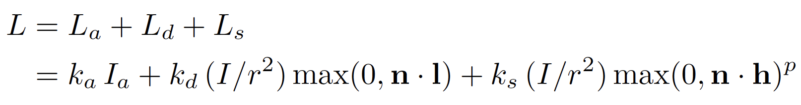

[TOC]

# Assignment00. 旋转点

此次作业采用Eigen线性代数运算库进行空间中点和向量的运算。

最基础的向量表示：`Eigen::Vector3f v(1.0f, 2.0f, 3.0f)`，向量之间加减数乘按照普通规则来，矩阵表示如下：

```c++
// Example of matrix
std::cout << "Example of matrix \n";
// matrix definition
Eigen::Matrix3f i,j;
i << 1.0, 2.0, 3.0, 4.0, 5.0, 6.0, 7.0, 8.0, 9.0;
j << 2.0, 3.0, 1.0, 4.0, 6.0, 5.0, 9.0, 7.0, 8.0;
```

`Matrix3f`表示一个$3\times 3$的矩阵。

作业内容是：

给定一个点 $P=(2,1)$，将该点绕原点先逆时针旋转$45^\circ$，再平移$ (1,2)$, 计算出 变换后点的坐标（要求用齐次坐标进行计算）。

首先要声明一个三维向量，包含一维的齐次坐标。按照课程中的方法，旋转变换和平移变换可以用矩阵的乘积表示，如下：
$$
R = R_t*R_\theta = 
\begin{bmatrix}
1 & 0 & t_x \\
0 & 1 & t_y \\
0 & 0 & 0
\end{bmatrix}

\begin{bmatrix}
\cos\theta & -\sin\theta & 0 \\
\sin\theta & \cos\theta & 0 \\
0 & 0 & 1
\end{bmatrix}
$$
所以只要计算出$R$，并左乘向量$P=(2,1)$即可：
$$
R = 
\begin{bmatrix}
1 & 0 & 1 \\
0 & 1 & 2 \\
0 & 0 & 1
\end{bmatrix}
\begin{bmatrix}
\frac{\sqrt 2}{2} & -\frac{\sqrt 2}{2} & 0 \\
\frac{\sqrt 2}{2} & \frac{\sqrt 2}{2} & 0 \\
0 & 0 & 1
\end{bmatrix}=
\begin{bmatrix}
\frac{\sqrt 2}{2} & -\frac{\sqrt 2}{2} & 1 \\
\frac{\sqrt 2}{2} & \frac{\sqrt 2}{2} & 2 \\
0 & 0 & 1
\end{bmatrix}
$$
写出程序：

```c++
double torad(const float a) {
    return a * M_PI / 180;
}

int main(){
    Eigen::Vector3f P(2, 1, 1);
    Eigen::Matrix3f R;
	// 需要将角度转换成弧度才能用C++自带的库函数，此外C++中用M_PI表示PI
    R << cos(torad(45)), -sin(torad(45)), 1,
         sin(torad(45)),  cos(torad(45)), 2,
         0,              0,               1;
    cout << "Rotation and Translation of P(2,1): " << endl;
    cout << R * P << endl;

    return 0;
}
```


也可以用Eigen自带的库函数，Eigen自带了旋转函数，在Sapce Transformation中可以查到：

```c++
int main(){
    Vector3f P(2, 1, 1);

    Rotation2Df r(M_PI / 4);	// 构造2维旋转矩阵
    Translation2f t(1, 2);		// 构造平移向量

    Matrix3f rot;				// 最终生成的变换矩阵
    rot.setIdentity();			// 初始化为单位阵
    // block<NRows, NCols>(startRow, startCol);
    rot.block<2, 2>(0, 0) = r.toRotationMatrix();		// 填充旋转矩阵
    rot.block<2, 1>(0, 2) = t.translation();			// 填充平移矩阵

    cout << rot * P << endl;
    
    return 0;
}
```


输出是一样的。这里要注意的就是各类矩阵的类型，一般来说使用浮点型，也就是后缀是f，类型不匹配会报错。Eigen中的旋转有角轴旋转（3D），四元数旋转（3D），旋转矩阵（2D&3D）。这里使用的旋转矩阵方法。具体参见链接：[Eigen使用笔记](http://zhaoxuhui.top/blog/2019/09/03/eigen-note-4.html#12d旋转)

# Assignment01. 旋转与投影

填写一个旋转矩阵和透视投影矩阵，实现对图像的旋转和透视操作。复习一下MVP变换。

https://blog.csdn.net/junzia/article/details/85939783

## Model矩阵

Model矩阵用于模型在模型空间中的转换（一般模型空间是右手系），是无限大的一个空间。Model矩阵隐含了旋转、平移、缩放三种变换。旋转包含三个方向的旋转：
$$
\begin{align}
&\begin{bmatrix}
1 & 0 & 0 & 0\\
0 & \cos\alpha & -\sin\alpha & 0\\
0 & \sin\alpha & \cos\alpha & 0 \\
0 & 0 & 0 & 1
\end{bmatrix} \quad 绕X轴旋转 \\ \\
&\begin{bmatrix}
\cos\beta & 0 & \sin\beta & 0\\
0 & 1 & 0 & 0\\
-\sin\beta & 0 & \cos\beta & 0 \\
0 & 0 & 0 & 1
\end{bmatrix} \quad 绕Y轴旋转 \\ \\
&\begin{bmatrix}
\cos\gamma & -\sin\gamma & 0 & 0\\
\sin\gamma & \cos\gamma & 0 & 0\\
0 & 0 & 1 & 0 \\
0 & 0 & 0 & 1
\end{bmatrix} \quad 绕Z轴旋转
\end{align}
$$

## View矩阵

View矩阵是观察者方向相对物体位置变化时用于描述对应变化的矩阵。观察者相对物体的位置变化也可以采用物体自身的变化来描述，可以用Model矩阵来描述，因为运动是相对的。

View矩阵的作用是将模型从模型世界的坐标系中转换到相对相机的观察坐标系中。相机的位置、观察的方向和相机向上的向量共同构成了观察坐标系，View矩阵就是将物体从模型坐标系变换到观察坐标系。

从世界坐标变换到相机空间坐标，一般有两步：

- 首先将世界坐标的基旋转到和相机空间基重合的位置，实际上就是从一个向量空间到另一个向量空间的变换，求出过渡矩阵即可：
  $$
  R = \begin{bmatrix}
  u_x & u_y & u_z & 0 \\
  v_x & v_y & v_z & 0 \\
  w_x & w_y & w_z & 0 \\
  0 & 0 & 0 & 1
  \end{bmatrix}
  $$
  这就是旋转矩阵。

- 然后将世界坐标平移到相机坐标的原点，由此可以得到旋转矩阵：
  $$
  T = \begin{bmatrix}
  1 & 0 & 0 & -t_x \\
  0 & 1 & 0 & -t_y \\
  0 & 0 & 1 & -t_z \\
  0 & 0 & 0 & 1
  \end{bmatrix}
  $$
  

## Projection矩阵

投影矩阵用于将相机空间转换到裁剪空间。因为屏幕不是无限大的。包括正交投影和透视投影。

### 正交投影

正交投影中$x,y$轴坐标不变，直接将$z$轴坐标去除。假设点$P(x,y,z)$经过model和view变换后得到$P_1(x_1, y_1, z_1)$，$P_1$经过正交投影变换得到$P_2(x_2,y_2,z_2)$，点$P_2$的$x,y,z$分量都在$[-1,1]$之间，因为正交投影变换是将点映射到标准视体（中心在原点，边长为2的立方体）中。

正交投影矩阵有六个参数，即待投影空间的范围，上平面$t$，下平面$b$，左平面$l$，右平面$r$，近平面$n$，远平面$f$。投影的过程是将待投影空间变换到标准视体的过程，标准视体是$[-1,1]\times [-1,1]\times [-1,1]$的一个范围，所以变换的过程就包括平移和缩放两个过程。包含两个矩阵：
$$
\begin{bmatrix}
x_{can} \\ y_{can} \\ z_{can} \\ 1 
\end{bmatrix}=\begin{bmatrix}
\frac{2}{r-l} & 0 & 0 & 0 \\
0 & \frac{2}{t-b} & 0 & 0 \\
0 & 0 & \frac{2}{n-f} & 0 \\
0 & 0 & 0 & 1
\end{bmatrix} \begin{bmatrix}
1 & 0 & 0 & -\frac{l+r}2 \\
0 & 1 & 0 & -\frac{t+b}2 \\
1 & 0 & 1 & -\frac{n+f}2 \\
0 & 0 & 0 & 1
\end{bmatrix} \begin{bmatrix} x \\ y \\ z \\1 \end{bmatrix}
 = M_oP
$$

### 透视投影

透视投影的作用就是将一个视锥（符和近大远小）转换成一个标准视体，需要先转换成正交投影，然后再变换到标准视体。输入参数有4个，广角fov（fovx或fovy）、宽高比aspect，近平面n，远平面f。采用这种方式定义时：


如图，可以得到透视投影转换成正交投影后，正交投影的范围$l,r,t,b,n,f$之间的关系：
$$
-l = r, aspect = \frac rt\\ -b=t, \tan\frac{fovY}{2} = \frac t{|n|} \\
$$
其中$n,f$已知，所以我们就能根据输入参数构建$M_o$，然后乘以透视矩阵$M_p$。$M_p$的过程是将视锥压缩成平行六面体（就是正交投影前的那个）。注意到视锥中物体的$y$坐标是和$z$成比例的：


同理对于$x$有$x'=\frac nz x$。现在我们知道了$x,y$如何变换，也就是坐标$(x,y,z,1)$怎么样从视锥中变到立方体：


$$
M_p\begin{bmatrix} x \\ y \\ z \\ 1 \end{bmatrix} =
\begin{bmatrix}
nx/z \\ ny/z \\ ? \\ 1
\end{bmatrix} = 
\begin{bmatrix}
nx \\ ny \\ ? \\ z
\end{bmatrix}
$$
现在未知的是$z$如何变化，根据上面的结果可以构造一个矩阵如下：
$$
M_p = \begin{bmatrix}
n & 0 & 0 & 0 \\
0 & n & 0 & 0 \\
? & ? & ? & ? \\
0 & 0 & 1 & 0 
\end{bmatrix}
$$
第三行是未知的，可以带入特殊点进行验证。首先在近平面的所有点的坐标是不会发生变化的，即$M_pP_n = P_n$，也就是当$z=n$时，坐标点不发生变化。此外远平面上所有点的$z$坐标也不会发生变化，即$z = f$时，坐标点的第三个分量不变。

首先，当$z=n$时，点$(x,y,n,1)$经过变换还是$(x,y,n,1)$，同乘以$n$，得到$(nx,ny,n^2,n)$，假设：
$$
M_p = \begin{bmatrix}
n & 0 & 0 & 0 \\
0 & n & 0 & 0 \\
a & b & c & d \\
0 & 0 & 1 & 0
\end{bmatrix}
$$
对比变换结果，因为$n^2 = ax+by+cn+d$，可得$a = b = 0$。

然后根据第二点，远平面上$z$坐标不变，$(x,y,f,1)$经过变换后为$(nx,ny,f,1)$，同乘以$f$，得到$(nfx,nfy,f^2,f)$，即$cf +d = f^2$，结合上面得式子：
$$
\begin{cases}
cn+d=n^2 \\
cf+d=f^2
\end{cases}
$$
求得$c=n+f,d=-nf$，即：
$$
M_p = \begin{bmatrix}
n & 0 & 0 & 0 \\
0 & n & 0 & 0 \\
0 & 0 & n+f & -nf \\
0 & 0 & 1 & 0
\end{bmatrix}
$$
有之前的结论得到：
$$
M_o = \begin{bmatrix}
\frac{2}{r-l} & 0 & 0 & -\frac{l+r}2 \\
0 & \frac{2}{t-b} & 0 & -\frac{t+b}2 \\
0 & 0 & \frac{2}{n-f} & -\frac{n+f}2 \\
0 & 0 & 0 & 1
\end{bmatrix}
$$
根据fovY，aspect和六面体的关系得：
$$
-b = t = \tan\frac{fovY}2\times |n| \\
-l = r = aspect \times t
$$
带入$M_o$就得到了完整的投影矩阵。

## 视口变换

将上面变换后的规范化设备坐标系NDC光栅化到2D平面进行显示。

作业要求实现旋转和透视投影矩阵，首先实现绕Z轴旋转的变换矩阵，函数接受一个角度参数，然后返回旋转矩阵：

```c++
Eigen::Matrix4f get_model_matrix(float rotation_angle) {
    Eigen::Matrix4f model = Eigen::Matrix4f::Identity();
    // TODO: Implement this function
    // Create the model matrix for rotating the triangle around the Z axis.
    // Then return it.
    
    // Rotation2Df rot(rotation_angle);
    Eigen::Matrix2f rot;

    float rad = rotation_angle * MY_PI / 180;
    rot << cos(rad), -sin(rad),  
           sin(rad), cos(rad);
	// 注释掉的是使用自带的旋转类的方法。
    // model.block<2, 2>(0, 0) = rot.toRotationMatrix();
    model.block<2, 2>(0, 0) = rot;

    return model;
}
```

下面实现透视投影矩阵，根据上面的描述，首先得到正交投影阵$M_o$：

```c++
Eigen::Matrix4f get_orthogonality_matrix(float xLeft, float xRight, float yTop,
                                         float yBottom, float zNear, float zFar)
{
    Eigen::Matrix4f ortho = Eigen::Matrix4f::Identity();
	// 分成缩放和平移两个变换
    Eigen::Matrix4f scale = Eigen::Matrix4f::Identity();
    Eigen::Matrix4f trans = Eigen::Matrix4f::Identity();
	// 缩放矩阵
    scale << 2 / (xRight - xLeft), 0,                    0,                  0,
             0,                    2 / (yTop - yBottom), 0,                  0,
             0,                    0,                    2 / (zNear - zFar), 0,
             0,                    0,                    0,                  1;
    trans << 1, 0, 0, -(xLeft + xRight) / 2,
             0, 1, 0, -(yTop + yBottom) / 2,
             0, 0, 1, -(zNear + zFar) / 2,
             0, 0, 0, 1;
    ortho = scale * trans;

    return ortho;
} 
```

然后构造透视投影矩阵，包括前面的正交投影矩阵以及将视锥变成平行六面体的变换：

```c++
Eigen::Matrix4f get_projection_matrix(float eye_fov, float aspect_ratio,
                                      float zNear, float zFar)
{
    // Students will implement this function
    Eigen::Matrix4f projection = Eigen::Matrix4f::Identity();
    
    // TODO: Implement this function
    // Create the projection matrix for the given parameters.
    // Then return it.
    // 注意这里zNear一定为负，因为以观察点为原点，向z轴负方向看去，远近平面都是负的。否则得到的三角形头向下。
    zNear = zNear > 0 ? -zNear : zNear;
    // 计算视锥的边界
    float yTop = tanf(eye_fov / 2) * abs(zNear);
    float yBottom = -yTop;

    float xRight = aspect_ratio * yTop;
    float xLeft = -xRight;
	// 构造M_P矩阵
    projection(0, 0) = zNear;
    projection(1, 1) = zNear;
    projection(2, 2) = zNear + zFar;
    projection(2, 3) = -zNear * zFar;
    projection(3, 2) = 1;
    projection(3, 3) = 0;
	// 正交投影变换矩阵 * M_P就得到了透视投影矩阵
    projection =  get_orthogonality_matrix(xLeft, xRight, yTop, yBottom, zNear, zFar) * projection;

    return projection;
}
```


结果如上图所示，按”A,D“可以进行旋转。

后面还有个提高项，构造一个函数，得到绕任意过原点的轴的旋转矩阵。旋转矩阵的推导可以由原向量$v$，轴向量$n$，旋转后的向量$v'$，来确定，具体关系如下：


得到的矩阵如下，加上齐次坐标：
$$
R(\boldsymbol n, \theta) =\begin{bmatrix}
n_x^2(1-\cos\theta)+\cos\theta & n_xn_y(1-\cos\theta)+n_z\sin\theta & n_xn_z(1-\cos\theta)-n_y\sin\theta & 0 \\
n_xn_y(1-\cos\theta)-n_z\sin\theta & n_y^2(1-\cos\theta)+\cos\theta & n_yn_z(1-\cos\theta)+n_x\sin\theta & 0 \\
n_xn_z(1-\cos\theta)+n_y\sin\theta & n_yn_z(1-\cos\theta)-n_x\sin\theta & n_z^2(1-\cos\theta)+\cos\theta & 0 \\
0 & 0 & 0 & 1
\end{bmatrix}
$$
代码如下：

```c++
Eigen::Matrix4f get_rotation(Vector3f axis, float angle) {
    Matrix4f rot = Matrix4f::Identity();

    float rad = angle * MY_PI / 180;
    // 轴向量的三个分量
    float n_x = axis(0);
    float n_y = axis(1);
    float n_z = axis(2);

    rot << n_x * n_x * (1 - cos(rad)) + cos(rad), n_x * n_y * (1 - cos(rad)) + n_z * sin(rad), n_x * n_z * (1 - cos(rad)) - n_y * sin(rad), 0,
           n_x * n_y * (1 - cos(rad)) - n_z * sin(rad), n_y * n_y * (1 - cos(rad)) + cos(rad), n_y * n_z * (1 - cos(rad)) + n_x * sin(rad), 0,
           n_x * n_z * (1 - cos(rad)) + n_y * sin(rad), n_y * n_z * (1 - cos(rad)) - n_x * sin(rad), n_z * n_z * (1 - cos(rad)) + cos(rad), 0,
           0, 0, 0, 1;   

    return rot;
}
```

# Assignments02. 三角形绘制和Z-Buffering

绘制一个实心的三角形，也就是栅格化一个三角形。同时处理深度值，显示两个三角形时，正确处理重叠关系。

要完成两个函数，第一个`rasterize_triangle(const Triangle& t)`，内部流程如下：

- 创建三角形的二维Bounding Box
- 遍历Bounding Box中所有的像素，然后判断像素的中心点是否在三角形内部（像素使用整数索引）
- 如果在内部，将其位置出的插值深度值与深度缓冲区中的相应值比较
- 如果当前点更靠近相机，请设置像素颜色并更新深度缓冲区

第二个`static bool insideTriangle(int x, int y, const Vector3f* _v)`用来判断像素是否在三角形内部。我们只知道三角形三个顶点的深度值，内部的深度值需要通过插值得到。

## 判断点在三角形内

首先实现判断点是否在三角形内部的函数，函数接受三个参数，点$P(x,y)$，和一个指向三角形三个顶点的数组，里面包含三个顶点`_v[0], _v[1], _v[2]`。判断依据是叉乘，同时点的顺序是按照逆时针排列的。按照$v[0]\rightarrow v[1],v[1]\rightarrow v[2],v[2]\rightarrow v[1]$的顺序组成三角形三条边，

分析一下源码：

```c++
//Screen space rasterization
void rst::rasterizer::rasterize_triangle(const Triangle& t) {
    auto v = t.toVector4();   
    // TODO : Find out the bounding box of current triangle.
    // iterate through the pixel and find if the current pixel is inside the triangle
    // If so, use the following code to get the interpolated z value.
    //auto[alpha, beta, gamma] = computeBarycentric2D(x, y, t.v);
    //float w_reciprocal = 1.0/(alpha / v[0].w() + beta / v[1].w() + gamma / v[2].w());
    //float z_interpolated = alpha * v[0].z() / v[0].w() + beta * v[1].z() / v[1].w() + gamma * v[2].z() / v[2].w();
    //z_interpolated *= w_reciprocal;

    // TODO : set the current pixel (use the set_pixel function) to the color of the triangle (use getColor function) if it should be painted.
}
```

光栅化三角形函数接收一个三角形类，然后经过`toVector4()`函数调用，它的过程如下：

```c++
std::array<Vector4f, 3> Triangle::toVector4() const
{
    std::array<Eigen::Vector4f, 3> res;
    std::transform(std::begin(v), std::end(v), res.begin(), [](auto& vec) { return Eigen::Vector4f(vec.x(), vec.y(), vec.z(), 1.f); });
    return res;
}
```

`toVector4()`将三角形的三个顶点转换成齐次坐标的形式，存储在一个长度为3的数组`res`中。所以我们上面返回的`v`就是一个`array<Vector4f, 3>`类型的数组。在调用`insideTriangle`时，第三个参数是一个指向`Vector3f`的指针，仿照注释中的调用方法，直接调用`t.v`即可得到三角形三个顶点所在位置。然后根据三个顶点计算三条边的向量（顺时针方向）：

```c++
Vector3f ab = _v[1] - _v[0];
Vector3f bc = _v[2] - _v[1];
Vector3f ca = _v[0] - _v[2];
```

`_v[i]`都是包含3个坐标的齐次坐标，叉乘是三维空间向量，所以不能用`Vector2f`，必须是`Vector3f`，所以直接两点坐标相减即可。然后同样的方法得到待定点和三角形顶点的向量。判断点是否在三角形内部的方法：
$$
cross1 = ab\times pa \\cross2= bc\times pb\\ cross3 = ca\times pc
$$
然后三个叉乘结果的$z$方向在同一个方向时就说明点在三角形内，否则在三角形外。完整代码如下：

```c++
static bool insideTriangle(int x, int y, const Vector3f* _v)
{   
    // TODO : Implement this function to check if the point (x, y) is inside the triangle represented by _v[0], _v[1], _v[2]
    Vector3f point = {x + 0.5, y + 0.5, 1.f};

    Vector3f ab = _v[1] - _v[0];
    Vector3f bc = _v[2] - _v[1];
    Vector3f ca = _v[0] - _v[2];

    Vector3f pa = _v[0] - point;
    Vector3f pb = _v[1] - point;
    Vector3f pc = _v[2] - point;

    Vector3f cross1 = ab.cross(pa);
    Vector3f cross2 = bc.cross(pb);
    Vector3f cross3 = ca.cross(pc);

    return cross1.z() * cross2.z() > 0 && cross2.z() * cross3.z() > 0 && cross3.z() * cross1.z() > 0;
}
```

## 光栅化三角形

光栅化三角形的过程就是扫描Bounding Box，判断每个点是否在三角形内部，如果在，根据三角形顶点插值确定颜色，然后更新z-buffer。如果不在，那么不改变像素颜色。

根据提示，首先确定Bounding Box，上边界是三角形上顶点的纵坐标，下边界是三角形下顶点的纵坐标，左右边界类似。Bounding Box采用4个值确定，分别代表左右$x$，上下$y$。

```c++
std::array<float, 4> bbx{0, 0, 0, 0}; // {x1, y1, x2, y2}
for (auto point : v) {
    bbx[0] = bbx[0] < point.x() ? bbx[0] : point.x();
    bbx[1] = bbx[1] < point.y() ? bbx[1] : point.y();
    bbx[2] = bbx[2] > point.x() ? bbx[2] : point.x();
    bbx[3] = bbx[3] > point.y() ? bbx[3] : point.y();
}
```

然后在Bounding Box的范围内，对所有的像素进行遍历决定像素颜色。框架中给出了设置像素颜色的函数`void rst::rasterizer::set_pixel(const Eigen::Vector3f& point, const Eigen::Vector3f& color)`，根据点的位置设置对应的颜色。颜色的获取函数是三角形类的接口`getColor()`，获取顶点颜色，然后输出：

```c++
for (int i = std::floor(bbx[0]); i < std::ceil(bbx[2]); ++i) {
    for (int j = std::floor(bbx[1]); j < std::ceil(bbx[3]); ++j) {
        if (insideTriangle(i, j, t.v)) {
            Vector3f point = {i, j, 1.f};
            set_pixel(point, t.getColor());
        }
    }
}
```

但是这个过程没有加入Z-Buffer。回顾一下深度缓冲算法，对每个像素点存储一个深度值，然后根据要绘制的三角形的$z$坐标，判断其与当前深度值的大小，选择较小的显示。三角形内部的深度值是通过顶点插值得到的：

```c++
// 计算三角形重心坐标
auto[alpha, beta, gamma] = computeBarycentric2D(x, y, t.v);
// v.w()是齐次坐标值
float w_reciprocal = 1.0/(alpha / v[0].w() + beta / v[1].w() + gamma / v[2].w());
float z_interpolated = alpha * v[0].z() / v[0].w() + beta * v[1].z() / v[1].w() + gamma * v[2].z() / v[2].w();
// 得到深度值
z_interpolated *= w_reciprocal;
```

然后根据得到的深度值`z_interpolated`来更新`depth_buf`，因为`z_interpolated`是大于0的，要取负值进行比较然后绘制像素：

```c++
int idx = get_index(x, y);
if (-z_interpolated < depth_buf[idx]) {
	depth_buf[idx] = -z_interpolated;
// TODO : set the current pixel (use the set_pixel function) to the color of the triangle (use getColor function) if it should be painted.
	set_pixel(point, t.getColor());
}
```

完整函数如下：

```c++
//Screen space rasterization
void rst::rasterizer::rasterize_triangle(const Triangle& t) {
    auto v = t.toVector4();

    // TODO : Find out the bounding box of current triangle.
    // iterate through the pixel and find if the current pixel is inside the triangle
    std::array<float, 4> bbx{0, 0, 0, 0}; // {x1, y1, x2, y2}

    for (auto point : v) {
        bbx[0] = bbx[0] < point.x() ? bbx[0] : point.x();
        bbx[1] = bbx[1] < point.y() ? bbx[1] : point.y();
        bbx[2] = bbx[2] > point.x() ? bbx[2] : point.x();
        bbx[3] = bbx[3] > point.y() ? bbx[3] : point.y();
    }

    for (int x = std::floor(bbx[0]); x < std::ceil(bbx[2]); ++x) {
        for (int y = std::floor(bbx[1]); y < std::ceil(bbx[3]); ++y) {
            if (insideTriangle(x, y, t.v)) {
                Vector3f point = {x, y, 1.f};                
                // If so, use the following code to get the interpolated z value.
                auto[alpha, beta, gamma] = computeBarycentric2D(x, y, t.v);
                float w_reciprocal = 1.0/(alpha / v[0].w() + beta / v[1].w() + gamma / v[2].w());
                float z_interpolated = alpha * v[0].z() / v[0].w() + beta * v[1].z() / v[1].w() + gamma * v[2].z() / v[2].w();
                z_interpolated *= w_reciprocal;
                // std::cout << z_interpolated << std::endl;
                int idx = get_index(x, y);
                if (-z_interpolated < depth_buf[idx]) {
                    depth_buf[idx] = -z_interpolated;
                    // TODO : set the current pixel (use the set_pixel function) to the color of the triangle (use getColor function) if it should be painted.
                    set_pixel(point, t.getColor());
                }
            }
        }
    }
    
}
```

然后是使用MSAA反走样。将一个像素分割成4个小像素，用这4个小像素颜色的均值来决定像素的颜色。当小像素落入三角形内部的数量越多，像素的颜色就越明显，否则越暗淡。

```c++
if (msaa) {
    auto steps = {0.25f, 0.75f};
    for (int x = std::floor(bbx[0]); x < std::ceil(bbx[2]); ++x) {
        for (int y = std::floor(bbx[1]); y < std::ceil(bbx[3]); ++y) {
                
            Vector3f point = {x, y, 1.f};
            int count = 0;					// 子像素落入三角形内部的数量
            float min_depth = FLT_MAX;

            for (auto delta_x : steps) {
                for (auto delta_y : steps) {
                    float subx = x + delta_x;		// 分割子像素
                    float suby = y + delta_y;
                    if (insideTriangle(subx, suby, t.v)) {
                        count++;
                        // If so, use the following code to get the interpolated z value.
                        // 计算三角形重心坐标
                        auto[alpha, beta, gamma] = computeBarycentric2D(x, y, t.v);
                        // v.w()是齐次坐标值
                        float w_reciprocal = 1.0/(alpha / v[0].w() + beta / v[1].w() + gamma / v[2].w());
                        // 得到深度值
                        float z_interpolated = alpha * v[0].z() / v[0].w() + beta * v[1].z() / v[1].w() + gamma * v[2].z() / v[2].w();
                        z_interpolated *= w_reciprocal;
                        min_depth = std::min(min_depth, z_interpolated);
                    }
                }
            }

            if (count) {
                int idx = get_index(x, y);
                if (-min_depth < depth_buf[idx]) {
                    depth_buf[idx] = -min_depth;
                    // TODO : set the current pixel (use the set_pixel function) to the color of the triangle (use getColor function) if it should be painted.
                    // 根据子像素在三角形内部的数量决定颜色
                    set_pixel(point, count * t.getColor() / 4.0);
                }   
            }                
        }
    }
}
```

# Assignment03. Blinn-Phong模型和纹理映射

作业内容：

- 修改函数`rasterize_triangle(const Triangle& t) in rasterizer.cpp`: 在此
  处实现与作业2 类似的插值算法，实现法向量、颜色、纹理颜色的插值。

- 修改函数`get_projection_matrix() in main.cpp`: 将你自己在之前的实验中
  实现的投影矩阵填到此处，此时你可以运行./Rasterizer output.png normal
  来观察法向量实现结果。

- 修改函数`phong_fragment_shader() in main.cpp`: 实现Blinn-Phong 模型计
  算Fragment Color.

- 修改函数`texture_fragment_shader() in main.cpp`: 在实现Blinn-Phong
  的基础上，将纹理颜色视为公式中的kd，实现Texture Shading Fragment
  Shader.

- 修改函数`bump_fragment_shader() in main.cpp`: 在实现Blinn-Phong 的
  基础上，仔细阅读该函数中的注释，实现Bump mapping.

- 修改函数`displacement_fragment_shader() in main.cpp`: 在实现Bump
  mapping 的基础上，实现displacement mapping.

## 1. 实现插值算法

这一步主要是实现差值算法和简单的法线贴图，根据贴图法线方向生成对应的像素的颜色。首先是切空间，它是由物体表面的法线、贴图的UV向量组成的一个坐标系，也就是TBN空间。定义切空间可以用来计算法线、凹凸、视差、置换贴图等。法线贴图就是用法线向量代表RGB三个通道的值，并将其作为纹理，显示到物体表面。


在高模中计算法线，生成凹凸不平的法线贴图，然后再将其应用到低模中，可以节省计算量并得到较好的效果


首先看`Triangle`的定义：

```c++
class Triangle{
public:
    Vector4f v[3]; /*the original coordinates of the triangle, v0, v1, v2 in counter clockwise order*/
    /*Per vertex values*/
    Vector3f color[3];              //color at each vertex;
    Vector2f tex_coords[3];         //texture u,v
    Vector3f normal[3];             //normal vector for each vertex

    Texture *tex= nullptr;
    Triangle();

    Eigen::Vector4f a() const { return v[0]; }
    Eigen::Vector4f b() const { return v[1]; }
    Eigen::Vector4f c() const { return v[2]; }

    void setVertex(int ind, Vector4f ver); /*set i-th vertex coordinates */
    void setNormal(int ind, Vector3f n); /*set i-th vertex normal vector*/
    void setColor(int ind, float r, float g, float b); /*set i-th vertex color*/

    void setNormals(const std::array<Vector3f, 3>& normals);
    void setColors(const std::array<Vector3f, 3>& colors);
    void setTexCoord(int ind,Vector2f uv ); /*set i-th vertex texture coordinate*/
    std::array<Vector4f, 3> toVector4() const;
};
```

可以看到其中定义了三个顶点的坐标、颜色、对应贴图的UV、法向。我们要做的就是对这三个值插值。代码中提供了插值函数`static Eigen::Vector3f interpolate(float alpha, float beta, float gamma, const Eigen::Vector3f& vert1, const Eigen::Vector3f& vert2, const Eigen::Vector3f& vert3, float weight)`，这个是3维向量版本的，还有一个二维向量版本的重载。

回想上一次作业，在确定哪些像素点在三角形内部后，根据深度值就可以确定当前像素绘制的颜色。这次不能直接绘制其颜色，而是要加入三角形插值后的顶点属性，以确定其颜色。分别对属性进行插值：

```c++
for (int x = std::floor(bbx[0]); x < std::ceil(bbx[2]); ++x) {
    for (int y = std::floor(bbx[1]); y < std::ceil(bbx[3]); ++y) {
        if (insideTriangle(x + 0.5, y + 0.5, t.v)) {
            Vector3f point = {x, y, 1.f};

            // If so, use the following code to get the interpolated z value.
            auto[alpha, beta, gamma] = computeBarycentric2D(x, y, t.v);
            float w_reciprocal = 1.0/(alpha / v[0].w() + beta / v[1].w() + gamma / v[2].w());
            float z_interpolated = alpha * v[0].z() / v[0].w() + beta * v[1].z() / v[1].w() + gamma * v[2].z() / v[2].w();
            z_interpolated *= w_reciprocal;
            
            int idx = get_index(x, y);
            if (-z_interpolated < depth_buf[idx]) {
                // 颜色插值
                auto interpolated_color = interpolate(alpha, beta, gamma, t.color[0], t.color[1], t.color[2], 1);
                // 发现插值
                auto interpolated_normal = interpolate(alpha, beta, gamma, t.normal[0], t.normal[1], t.normal[2], 1);
                // 纹理插值
                auto interpolated_texcoords = interpolate(alpha, beta, gamma, t.tex_coords[0], t.tex_coords[1], t.tex_coords[2], 1);
                // Shading坐标插值
                auto interpolated_shadingcoords = interpolate(alpha, beta, gamma, view_pos[0], view_pos[1], view_pos[2], 1);
				// 构造传递结果的结构体
                fragment_shader_payload payload( interpolated_color, interpolated_normal.normalized(), interpolated_texcoords, texture ? &*texture : nullptr);		
                // 设置观察位置，也就是观察向量
                payload.view_pos = interpolated_shadingcoords;
                // Use: Instead of passing the triangle's color directly to the frame buffer, pass the color to the shaders first to get the final color;
                auto pixel_color = fragment_shader(payload);

                depth_buf[idx] = -z_interpolated;
                set_pixel(point, pixel_color);
        	}
    	}
	}
}
```

然后修改`get_projection_matrix() in main.cpp`，将前面实验的代码加入，修改`eye_fov`为弧度，即可。这样就完成了第1，2步。

做到这步在运行的时候还是有些问题，就是运行速度很慢，而且一直不出结果。经过排查，是Bounding Box出现了问题，在计算bbx的时候，每次都要得到`point.x()`等，耗时较多，直接取`x,y`中最大的和最小的即可：

```c++
// 原版
for (auto point : v) {
     bbx[0] = bbx[0] < point.x() ? bbx[0] : point.x();
     bbx[1] = bbx[1] < point.y() ? bbx[1] : point.y();
     bbx[2] = bbx[2] > point.x() ? bbx[2] : point.x();
     bbx[3] = bbx[3] > point.y() ? bbx[3] : point.y();
}

int x_min = std::floor(bbx[0]);
int x_max = std::ceil(bbx[2]);
int y_min = std::floor(bbx[1]);
int y_max = std::ceil(bbx[3]);

// 修正版
float min_x = std::min(v[0][0], std::min(v[1][0], v[2][0]));
float max_x = std::max(v[0][0], std::max(v[1][0], v[2][0]));
float min_y = std::min(v[0][1], std::min(v[1][1], v[2][1]));
float max_y = std::max(v[0][1], std::max(v[1][1], v[2][1]));

int x_min = std::floor(min_x);
int x_max = std::ceil(max_x);
int y_min = std::floor(min_y);
int y_max = std::ceil(max_y);
```

这样就可以很快生成图片了：


## 3. 实现Blinn-Phong模型

Blinn-Phong模型包含三项，环境光、漫反射、高光。

### a. 环境光

环境光比较简单，可以假设光是从四面八方射过来，到达物体表面时的能量（强度）为$I$，然后乘以物体表面材质的环境光系数$k_a$：
$$
L_a = k_a \times I
$$

### b. 漫反射


漫反射在物体表面是和观察者位置无关的，影响它的因素主要是表面法线和光线方向。到达物体的能量反射出去的和法向与入射光线的夹角有关。

### c. 高光


高光会随着观察者的角度发生变化，所以要加入观察者视角v，同时，为了方便计算$\cos\alpha$，不妨加入半程向量h。

最终就可以得到Blinn-Phong模型的结果：



在代码中，修改`phong_fragment_shader() in main.cpp`，在`for`循环中遍历光线，计算模型参数。所给框架代码中，`point`是物体表面所在位置。`squaredNorm`用来计算L2范数，也就是自身长度。`cwiseProduct`用来计算向量数乘，也就是对应点乘。

```c++
for (auto& light : lights)
{
    // TODO: For each light source in the code, calculate what the *ambient*, *diffuse*, and *specular* 
    // components are. Then, accumulate that result on the *result_color* object.
    // 光线向量
    Eigen::Vector3f l = (light.position - point).normalized();
    Eigen::Vector3f v = (eye_pos - point).normalized();
    // 半程向量，h = v + l
    Eigen::Vector3f h = (v + l).normalized();
    // squaredNorm是平方再开方，也就是向量的长度，光源到物体的距离
    auto r2 = (light.position - point).squaredNorm();
    // 环境光
    auto ambient = ka.cwiseProduct(amb_light_intensity);
    // 漫反射
    auto diffuse = kd.cwiseProduct(light.intensity / r2 * std::max(0.0f, normal.dot(l)));
     // 高光
     auto specular = ks.cwiseProduct(light.intensity / r2 * std::pow(std::max(0.0f, normal.dot(h)), p));
		 // 因为是多数光线叠加的效果，所以要result_color自增。
     result_color += ambient + diffuse + specular;
}
```

最终结果如下图所示：


## 4. 实现Texture Shading Fragment Shader

要修改的包括两个部分，首先从payload获取材质颜色。在Texture类中定义了`getColor`方法，用来获取纹理坐标对应的颜色，这里纹理坐标可能为负，所以加入了限定，固定其在$[0,1]$之间。

```c++
Eigen::Vector3f getColor(float u, float v)
    {
    	u = u < 0 ? 0 : u;
        u = u > 1 ? 1 : u;
        v = v < 0 ? 0 : v;
        v = v > 1 ? 1 : v;
        auto u_img = u * width;
        auto v_img = (1 - v) * height;
        auto color = image_data.at<cv::Vec3b>(v_img, u_img);
        return Eigen::Vector3f(color[0], color[1], color[2]);
    }
```

返回材质贴图对应U，V处的颜色值，然后附加到对应位置的颜色上：

```c++
if (payload.texture)
    {
        // TODO: Get the texture value at the texture coordinates of the current fragment
    	// 获取纹理坐标的颜色
        return_color = payload.texture->getColor(payload.tex_coords.x(), payload.tex_coords.y());
    }
```

第二步要求计算对应位置的环境光、漫反射、高光，这里和Blinn-Phong模型完全相同，最后得到如下图：


## 5. 在Blinn-Phong的基础上实现法线贴图

Bump Mapping即凹凸贴图，也就是法线贴图。通过将物体表面的法线方向记录在法线贴图上，在着色时使用这些法线信息来计算每个像素上的光照，这样就能够在不增加顶点数量的情况下增加物体变面凹凸细节。


通常我们要为每个fragment提供一个法线，而不是每个三角形。用法向的$x,y,z$表示RGB颜色，法线向量的范围在$[-1,1]$，所以要进行归一化Normalized。正常法线贴图都是偏蓝色的，因为法线向量是$(0,0,1)$，归一化计算后就变成了$(0.5,0.5,1)$，对应到颜色就是$(128,128,255)$，也就是偏蓝的颜色。

https://www.cnblogs.com/lookof/p/3509970.html

实现Bump Mapping时，按照注释填写即可：

```c++
// TODO: Implement bump mapping here
    // Let n = normal = (x, y, z)
    // Vector t = (x*y/sqrt(x*x+z*z),sqrt(x*x+z*z),z*y/sqrt(x*x+z*z))
    // Vector b = n cross product t
    // Matrix TBN = [t b n]
    // dU = kh * kn * (h(u+1/w,v)-h(u,v))
    // dV = kh * kn * (h(u,v+1/h)-h(u,v))
    // Vector ln = (-dU, -dV, 1)
    // Normal n = normalize(TBN * ln)
    Eigen::Vector3f n = normal.normalized();

    float x = n.x(), y = n.y(), z = n.z();
    Eigen::Vector3f t{x*y / sqrt(x*x + z*z), sqrt(x*x + z*z), z*y / sqrt(x*x + z*z)};
    Eigen::Vector3f b = n.cross(t);
    Eigen::Matrix3f TBN;
    TBN << t.x(), b.x(), n.x(),
           t.y(), b.y(), n.y(),
           t.z(), b.z(), n.z();
    
    float u = payload.tex_coords.x();
    float v = payload.tex_coords.y();
    float w = payload.texture->width;
    float h = payload.texture->height;

    float dU = kh * kn * (payload.texture->getColor(u + 1.0f/w, v).norm() - payload.texture->getColor(u, v).norm());
    float dV = kh * kn * (payload.texture->getColor(u, v + 1.0f/h).norm() - payload.texture->getColor(u, v).norm());

    Eigen::Vector3f ln{ -dU, -dV, 1.0f };
    normal = (TBN * ln).normalized();
```

整个过程就是根据法向方向求出切线方向，并建立坐标系TBN，得到TBN矩阵。

Displacement Mapping同样如此。最后结果如下。BumpMapping：


Displacement Mapping：


