[TOC]

# Chapter01. 引言

# Chapter02. 数学知识

## 2.1 集合与映射

## 2.2 解二次方程

## 2.3 三角学

三角函数

## 2.4 向量

### 2.4.3 点积

通过点积计算向量夹角。

### 2.4.4 叉积

图形学中叉积一般用于判断向量的相对位置和点相对向量的位置

## 2.5 二维隐式曲线

简单来说就是二元函数的隐式方程。

## 2.6 二维参数曲线

二维曲线的参数方程。

## 2.7 三维隐式曲面

## 2.10 线性插值

## 2.11 三角形

过三点的三角形面积公式：

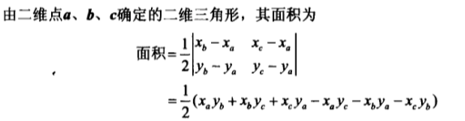

图形学中，经常用三点的值的某一性质（例如颜色）插值到三角形中。最简单的就是利用重心。可以建立重心坐标系：

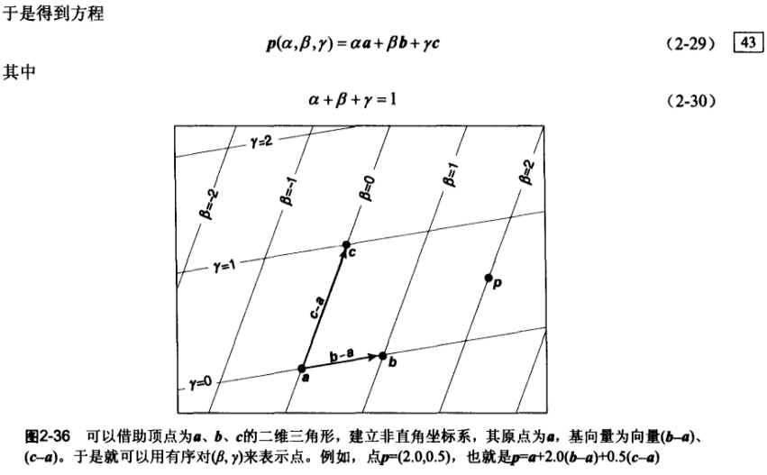

# Chapter03. 光栅算法

## 3.1 光栅显像

编程人员通常假设像素按矩形排列，称为光栅（raster）。

以整数点作为像素中心：

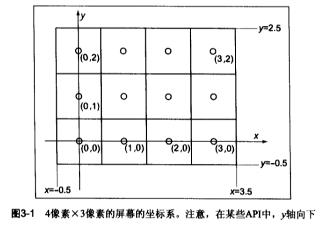

## 3.2 显示器亮度和$\gamma$值

显示器对输入信号的处理是非线性的，输入的像素值为0、0.5、1.0，实际亮度可能是0、0.25、1.0。一般用$\gamma$值来近似非线性：
$$
显示亮度=(最大亮度)a^{\gamma}
$$
其中$a$是介于0，1之间的亮度值。

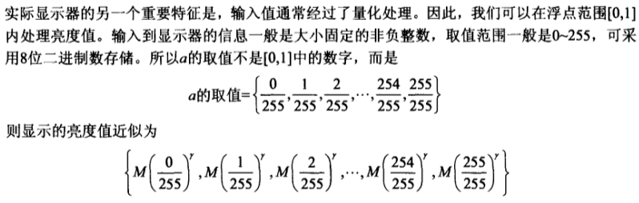

## 3.3 RGB颜色

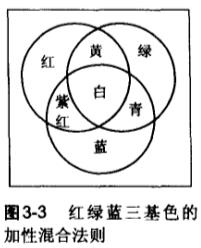

类似灰度值，RGB也是在$0~1$之间的分数，可以构建一个RGB立方体，里面所有的点就是色域：

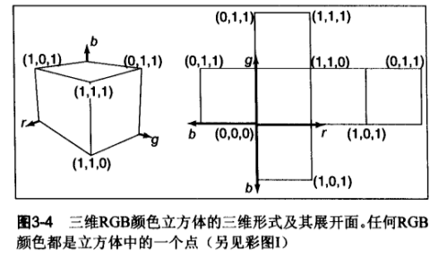

## 3.4 $\alpha$通道

对于有前景和背景的图片来说，如果前景不透明，那么只需要用前景替换对应位置的像素即可；如果前景完全透明，那么只显示背景即可。对于半透明的前景，就要权衡前景像素和背景像素的RGB比例，即$\alpha$分数。如果想把前景色$c_f$和背景色$c_b$混合，被前景覆盖的像素的分数是$\alpha$，那么有：
$$
c=\alpha c_f+(1-\alpha)c_b
$$

## 3.5 直线绘制

### 3.5.1 基于隐式方程绘制直线

绘制两点$(x_0,y_0),(x_1,y_1)$之间的一条直线，找到隐式方程：
$$
f(x,y) = (y_0-y_1)x+(x_1-x_0)y+x_0y_1-x_1y_0=0
$$
直线的斜率是：
$$
m=\frac{y_1-y_0}{x_1-x_0}
$$

中点算法的重要假设是：我们可以绘制出最细的直线，并且量对角像素之间的连接不产生间隔。当$m\in (0,1]$时，$x$方向的变换率大于$y$方向，这种情况绘制直线按照假设只有两种可能，绘制左边的像素时，和右边一样高或者高出一个像素；并且两端点之间的每一列总是只有一个像素。即，同一行可以有两个像素，同一列只有一个像素。

针对$m\in (0,1]$的中点算法过程如下：

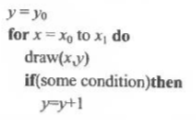

可以看出关键是`some condition`中如何确定要绘制不同行的元素。一种方法是参考中点位置，如果直线通过中点位置$(x+1,y+0.5)$的上方就绘制上面的像素，否则绘制下面的像素。

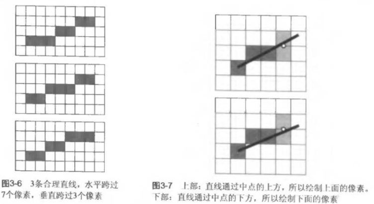

判断点相对直线的位置可以将点的坐标带入直线方程，如果满足$f(x,y)>0$则说明中点在直线上方。即若$f(x+1,y+0.5)<0$则$y=y+1$。

为了提升效率，可以采用增量算法，我们经过第一次计算得到了$f(x,y+0.5)或f(x,y-0.5)$的值，要得到$f(x+1,y)或f(x+1,y+1)$的值根据直线方程有：

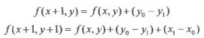

所以算法可以写作如下：

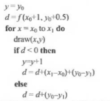

整数运算通常较快，$f(x_0+1,y_0+0.5)$不是整数运算。初始化时我们要计算$d$：
$$
f(x_0+1,y_0+0.5)=(y_0-y_1)(x_0+1)+(x_1-x_0)(y_0+0.5)+x_0y_1-x_1y_0
$$
如果$f(x,y)=0$是直线方程，那么$2f(x,y)=0$也是直线方程，将上面的方程乘以2，就可以得到完全整数运算的算法：

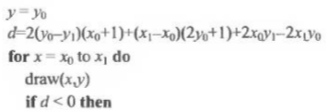

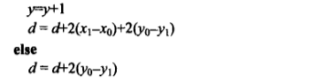

### 3.5.2 基于参数方程绘制直线

存疑

## 3.6 三角形光栅化

在屏幕上绘制一个三角形时，希望能够根据顶点数值在三角形内部插入颜色或其他属性，假设顶点颜色是$c_0,c_1,c_2$，那么重心坐标是$(\alpha,\beta,\gamma)$的三角形内部，某点的颜色就是：$c=\alpha c_0+\beta c_1+\gamma c_2$。这称为Gouraud插值法。

最常用的三角形光栅化方法有一个约定：当且仅当一个像素中心在三角形内部时才绘制该像素。所以我们在根据顶点插入颜色时，利用重心坐标可以确定是否绘制像素。蛮力的光栅化算法如下：

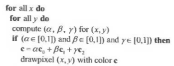

为了更快迭代，可以不用遍历整个屏幕，而是将三角形限制在矩形内，然后在矩形内计算：

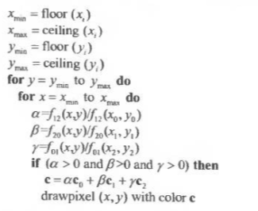

其中$f_{ij}$是根据顶点确定的直线。

处理三角形边上的像素：

上面之说了像素中心在三角形内的情况，如果中心在三角形边上时怎么办呢？如果是两个相邻三角形，不画的话会造成空隙，都画的话会造成重复绘制，最好的方法就是将这个像素归于一个三角形，而归于哪一个是没有关系的。

这样，我们可以确定屏幕外一点，然后通过直线方程的方法，判断和三角形非公共边顶点是否同号，如果同号就安排这个像素属于同号的三角形。通常选$(-1,-1)$这一点。

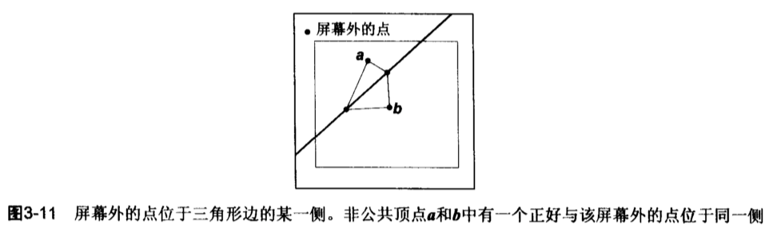

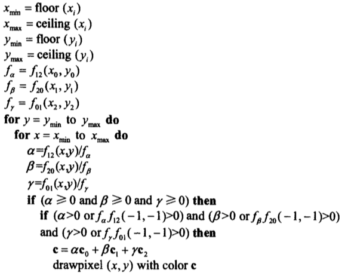

## 3.7 简单反走样技术

通过盒式滤波器可以进行简单的反锯齿：

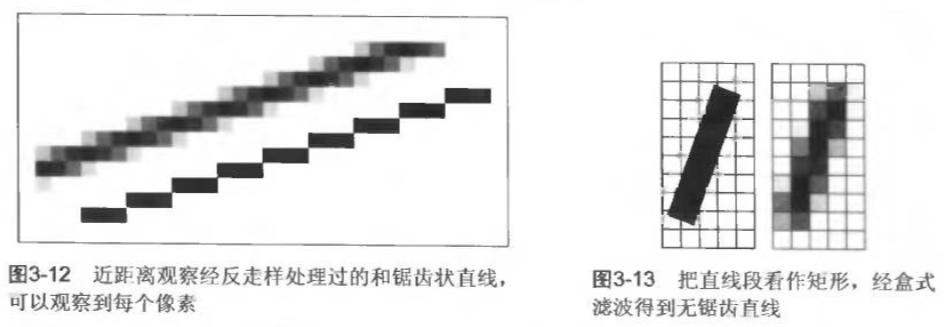

盒式滤波首先建立高分辨率图像，然后进行下采样实现的。

## 3.8 图像捕捉与存储

### 3.8.1 扫描仪和数码相机

### 3.8.2 图像存储

存储RGB图像分为有损压缩和无损压缩两种：

- GIF：有损压缩，只能表示256种颜色
- JPEG：有损，以人类视觉阈值作为基础
- TIFF：无损
- PNG：无损格式集合

# Chapter04. 信号处理

像素将连续的图像显示在屏幕上，这一步其实就将连续的图像变成了离散的。如果我们要将图像放大或者缩小都会出现锯齿（走样）。

## 4.1 数字音频：一维采样

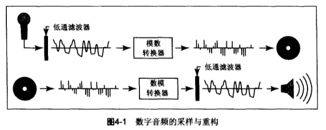

模数转换器（ADC）每秒测量电压数千次产生整数流存储到介质中，播放时整数流通过数模转换器（DAC）产生电压作用到薄膜振动发声。

- 欠采样干扰：假设采样的速度可以很好地重现弦低音或击鼓的声音，但是如果将这个采样速度用于短笛或钹的声音则会造成失真，这种情况只能采用更高的采样速度。
- 重构干扰：在输出端DAC产生一个电压，每当新样本到来电压会改变，但是在新样本到来之前是恒定的，因此会产生阶梯状的波形，这些波形就像是噪声，附加了一个高频

上述两种情况都可以采用低通滤波器解决。

### 采样干扰与走样

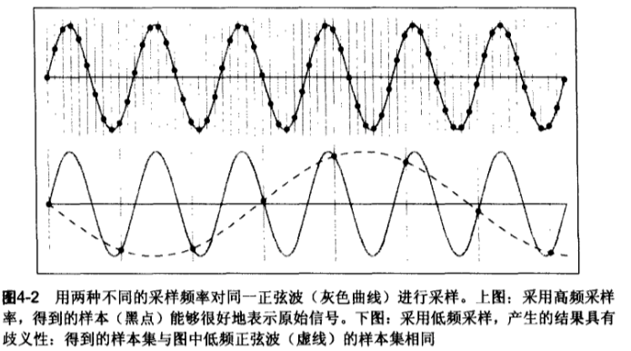

低频采样和高频采样之后得到了样本集，但是不知道哪个和原始信号对应，这就造成了走样。对于图像来说会形成莫尔图案。这类似机器学习中的欠拟合和过拟合，过多的特征和过少的特征都会造成失真。

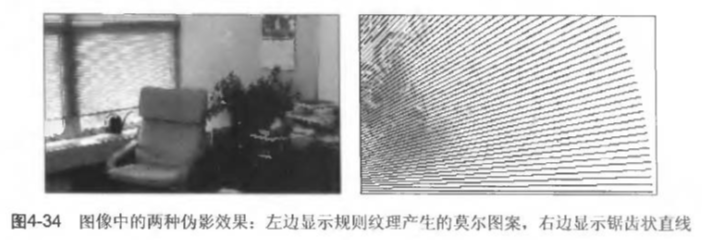

## 4.2 卷积

卷积是采样、滤波、重构等算法的基础。

### 4.2.1 滑动平均

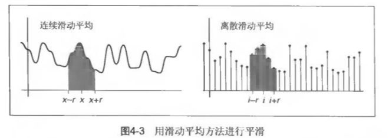

滑动平均相当于在区间上对积分取均值，也就是函数在这个区间内的均值，对于连续函数$g(x)$而言：
$$
h(x) = \frac{1}{2r}\int_{x-r}^{x+r}g(x)dx
$$
$h(x)$就是其在区间$[x-r,x+r]$上的平均值。用它可以对一维函数进行平滑处理。同样的离散函数$b[i]$有：
$$
c[i] = \frac{1}{2r+1}\sum_{j=i-r}^{i+r}b[j]
$$

### 4.2.2 离散卷积

卷积本质上就是一个滑动平均的过程，只不过是一种加权平均。上述是可以看成权重均为1的卷积过程。

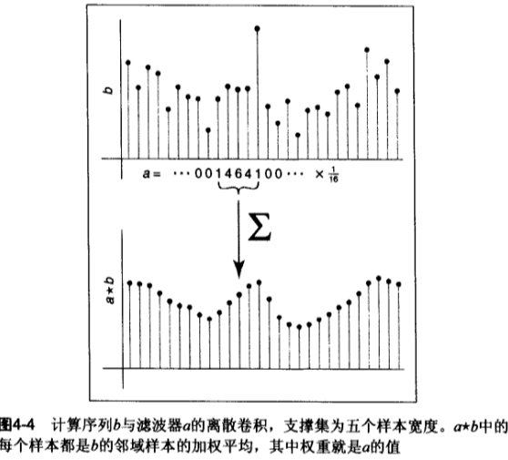

#### 1. 卷积滤波器

滑动平均中是特殊的卷积函数，为常函数，这种滤波器是盒式滤波器。例如阶跃函数和5个步长的盒式滤波器做卷积：

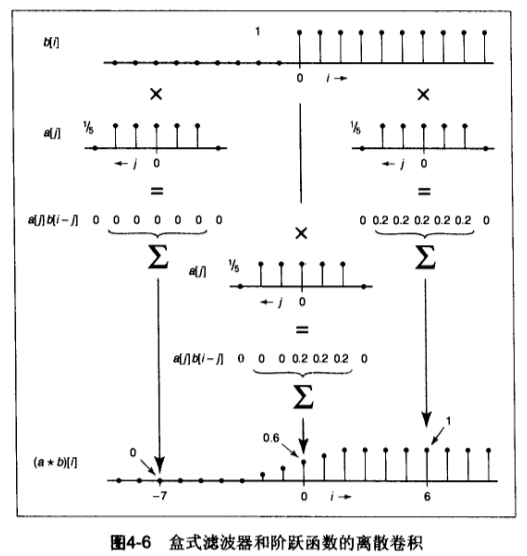

#### 2. 卷积性质

卷积满足交换律、结合律、分配律（加法）。

### 4.2.3 把卷积看作移位滤波器之和

### 4.2.4 与连续函数的卷积

卷积公式：
$$
(f*g)(x) = \int_{-\infty}^{+\infty}f(t)g(x-t)dt
$$
一种解释是，$x$处$f*g$的值就是移动$f$使得$f(0)$与$g(x)$对应后，两函数之积所形成的曲线下面的面积：

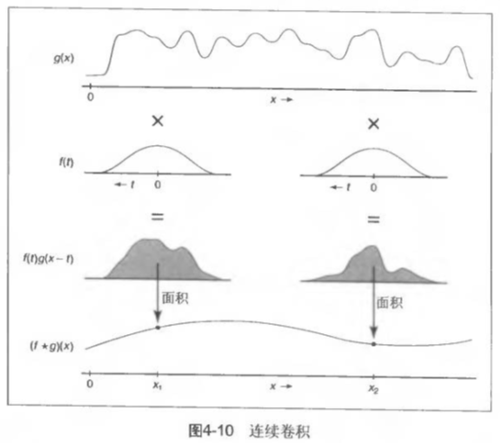

### 4.2.5 离散-连续卷积

## 4.3 卷积滤波器

### 4.3.1 各种卷积滤波器

#### 1. 盒式滤波器

离散的盒式滤波器：
$$
a_{box,r}[i]=\begin{cases}
1/(2r+1) & |i|\leq r \\
0 & Otherwise
\end{cases}
$$
连续的盒式滤波器：

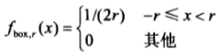

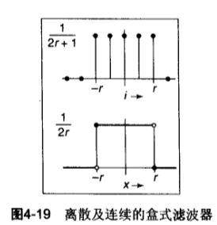

#### 2. 帐篷式滤波器

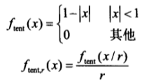

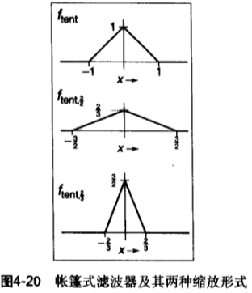

#### 3. 高斯滤波器

其实就是正态分布：

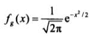

etc.

### 4.3.2 滤波器性质

二维图像滤波就是卷积过程。

## 4.4 图像信号处理

### 4.4.1 离散图像滤波

对图像进行卷积，可以提取各种图像的特征，也可以对图像进行模糊和锐化等操作。

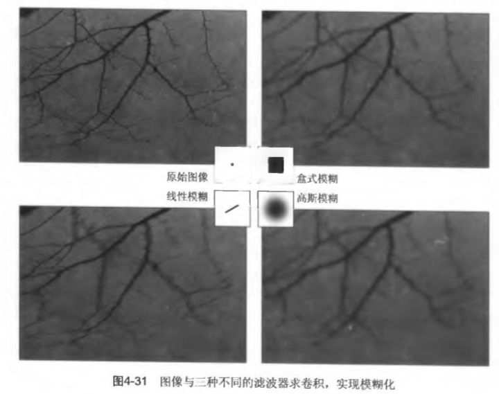

### 4.4.2 图像采样中的反走样技术

对图像进行处理的时候通常会产生走样（锯齿），可以通过高斯模糊进行卷积得到平滑图像，但是也会使图像变得模糊，所以在选择反走样滤波器的时候要在清晰和反走样之间进行折衷。

### 4.4.3 重构与重采样

重采样就是改变采样的速度和图像的大小。将3000x2000图像变成1280x1024的图像，可以采用直接删除像素的方法，但是容易造成图像的失真。一种解决方法是使用滤波器对原始图像进行重构，然后对重构后的图像进行采样：

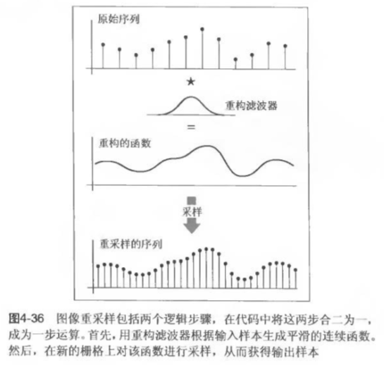

# Chapter06. 矩阵变换

## 6.1 基本二维变换

包括缩放、切变、旋转、镜像（反射）

### 6.1.2 切变

$$
shear_x(s)=\begin{bmatrix}
1 & s \\ 0 & 1
\end{bmatrix}, 
shear_y(s)=\begin{bmatrix}
1 & 0 \\ s & 1
\end{bmatrix}
$$

将图像在水平或者垂直方向上倾斜：

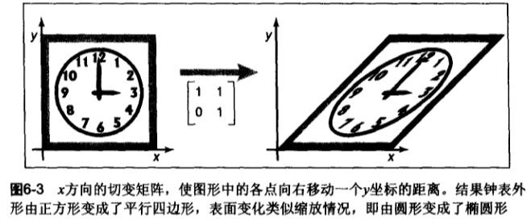

### 6.1.3 旋转

固定旋转点是原点，得到旋转矩阵：
$$
rotate(\phi) = \begin{bmatrix}
\cos\phi & -\sin\phi \\ \sin\phi & \cos\phi
\end{bmatrix}
$$
旋转矩阵都是正交阵。

### 6.1.5 二维变换组合

例如先旋转$R$后缩放$S$，对于一个向量$\vec v$来说，首先旋转，$\vec {v_1} = R\vec v$，然后缩放，$\vec{v_2}=S\vec{v_1}$ ，结合起来就是$\vec{v_2}=SR\vec{v}$，也就是说两个矩阵的变换效果可以通过一个矩阵表示出来。

### 6.1.6 二维变换分解

对于一个矩阵，可以将其拆成多个矩阵相乘的形式，每个矩阵对应了一个变换。任何二维矩阵都可以分解成旋转、缩放、旋转三种矩阵之积。这个过程可以通过奇异值分解实现，一个二维矩阵的奇异值分解的结果就是旋转矩阵和缩放矩阵的乘积：

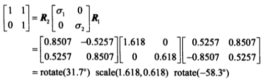

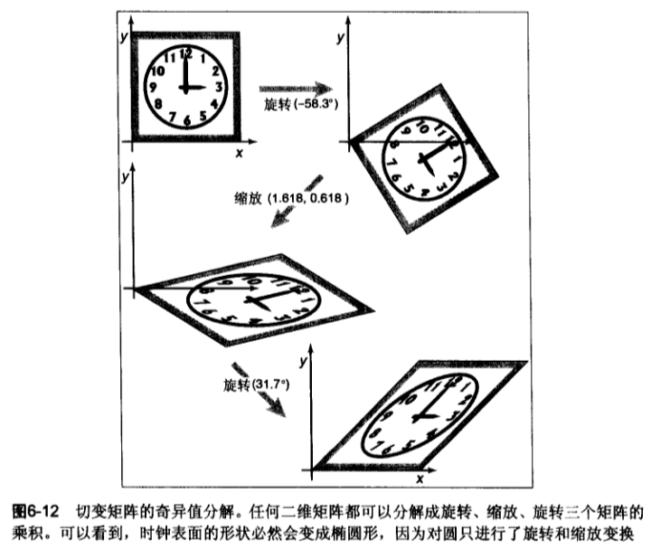

另外一种分解的方法就是通过切变表示旋转：

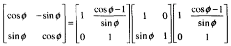

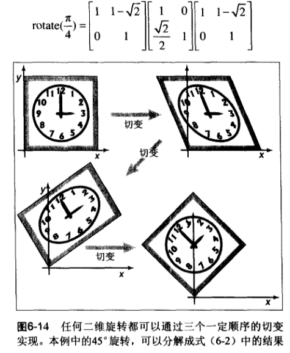

## 6.2 基本三维变换

基本和二维类似，旋转稍微复杂一点，因为旋转轴较多，可以绕三个坐标轴旋转，事实上，绕这三个轴旋转即可将物体旋转到任意角度。

### 6.2.1 任意三维旋转

对于一个3维正交阵代表的旋转矩阵，它的每个行向量都是标准正交基，矩阵和基相乘，也就是变换的结果是将三个基旋转到笛卡尔坐标系中：

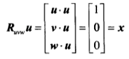

即将坐标轴$\boldsymbol{uvw}$，旋转到$\boldsymbol {xyz}$上。同时矩阵$R_{uvw}$的逆矩阵（转置矩阵）就是对应旋转的逆变换。

如果要绕任意向量$\boldsymbol a$进行旋转，可以先构造一个正交基$\boldsymbol w=\boldsymbol a$，然后将这个正交基旋转到$\boldsymbol{xyz}$，然后绕$\boldsymbol z$旋转，再把标准基旋转回$\boldsymbol {uvw}$。

### 6.2.2 法向量变换

三维表面的切向量变换后仍然相切，但是法向量却不一定垂直：

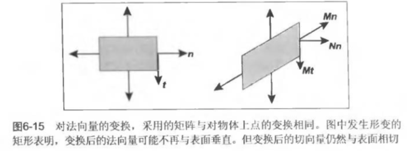

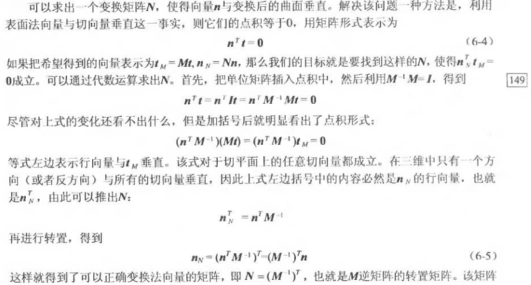

## 6.3 平移

所有以上的变换都可以表示成一个矩阵乘以一个向量的形式，但是平移变换却不能这么表示。为了解决这个问题，我们可以将变换置于更高的维度，在向量和点中添加一个维度来完成统一的表示。

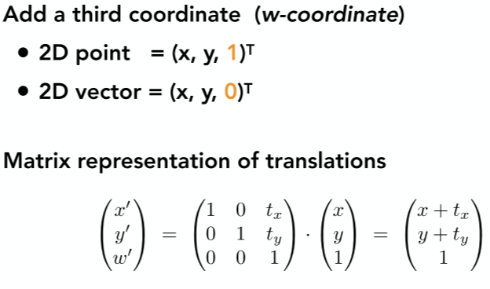

另外一个就是窗口变换，我们需要将一个矩形中的点变换到另外一个矩形中，可以通过缩放然后平移两次完成，也可以通过三个步骤完成：

- 将矩形移动到原点
- 缩放到目标矩形的大小
- 然后将原点移动到目标矩形的左下角

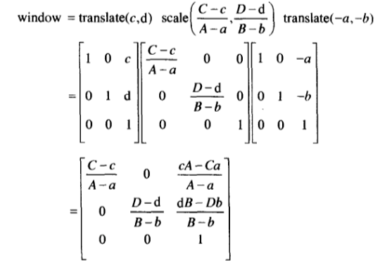

# Chapter07. 观察

这里解决的问题就是将三维空间中的点或者物体如何显示到对应的屏幕上。

## 7.1 绘制标准视体

现在我们要将直线沿着z轴的正方向映射到屏幕上。为此设置一个标准视体，就是边长为2，中心点在原点的立方体：

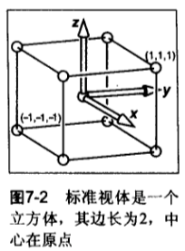

假设屏幕大小是$n_x \times n_y$，每个像素有0.5个单位的过冲，左下角在原点，像素中心为$(0,0)$，屏幕的边界为$[-0.5,n_x-0.5]\times[-0.5,n_y-0.5]$（两个坐标轴的边界）。这和上面的窗口变换是一样的（先将原来标准视体的矩形移动到原点，然后缩放到屏幕大小，然后将原点移动到左下角像素中心）。变换式为：

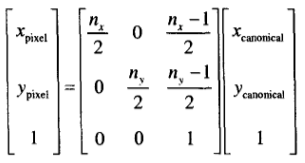

这个过程其实就是将标准视体这个方形框转换到成屏幕这个大矩形中。

## 7.2 正射投影

正射投影在现实中平行的线段在投影视图中还是平行的。如果要将一个空间中的线段转换到标准视体中，需要一个投影矩阵：

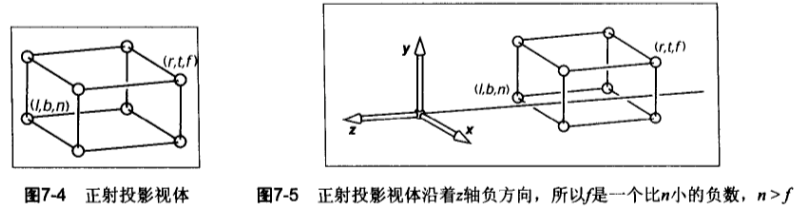

这里将$y=b$变成$y=-1$，$y=t\rightarrow y=1$；$x=l\rightarrow -1$；$z=n\rightarrow z=1, z=f\rightarrow z=-1$.变换公式如下：

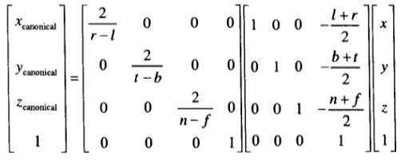

先缩放后平移或者先平移后缩放。

为了将三维线段绘制在屏幕上，可以结合7.1中的矩阵实现转换：

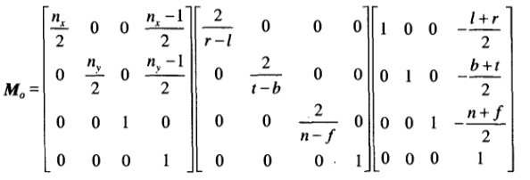

这样就可以将空间坐标系中的三维点转换到可以显示的屏幕上了。

### 任意视点

在空间的任意一个位置观察物体，规定：

- 眼睛位置$\boldsymbol e$
- 眼睛看的方向$\boldsymbol g$
- 向上的向量$\boldsymbol t$

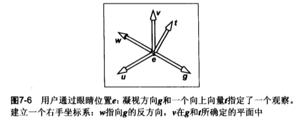

通过这三个坐标可以建立一个标准正交系$\boldsymbol {uvw}$：
$$
\begin{align}
{\boldsymbol w} &= -\frac{\boldsymbol g}{||\boldsymbol g||}\\
{\boldsymbol u} &= \frac{{\boldsymbol t}\times {\boldsymbol w}}{||{\boldsymbol t}\times {\boldsymbol w}||}\\
{\boldsymbol v} &= {\boldsymbol w} \times {\boldsymbol u}
\end{align}
$$
我们要解决的问题是将$\boldsymbol {uvw}$中的点转换到${\boldsymbol {xyz}}$中，然后显示在屏幕上，可以先将$\boldsymbol e$移动到原点，然后将坐标轴位置摆正就可以了。因为在坐标移动的过程中，$\boldsymbol {uvw}$中的物体也是随着坐标系一起移动的，最后得到的就是物体相对于$\boldsymbol {xyz}$的相对位置。

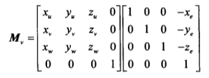

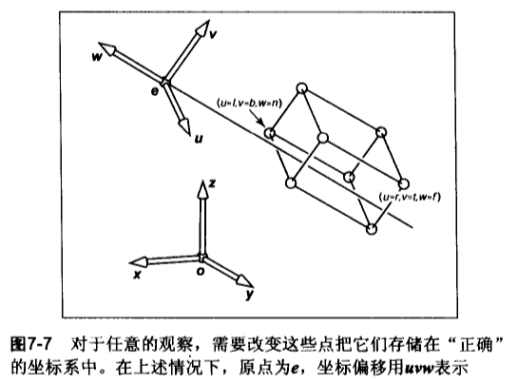

## 7.3 透视投影

相比于正射投影，透视投影有一个特点就是近大远小。透视投影将物体直接向眼睛投影，并画在投影线与眼睛前面的观察平面相交的位置。

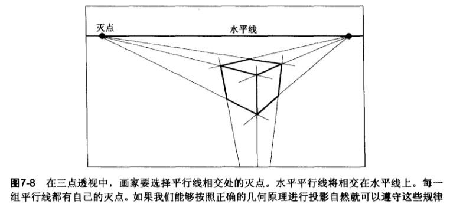

将观察点放在原点，向$z$轴负方向观察，物体大小和$z$轴坐标成反比：$y_s=\frac dz y$：

我们希望像正射投影那样，建立一个矩阵机制来绘制图像。这里z轴的坐标可以不用关心，因为正射投影的时候会忽略z值。

将观察平面设置为$z=n$，然后按照光线将后面的大矩形缩放到正射投影的小矩形上。这一步的特点就是将之前所有通过观察点的直线全部变换成平行线。

上面说过，这一步需要除以$z$来实现，可以通过第四维的齐次坐标来实现这个过程。第4维坐标表示了其他三个坐标轴的缩放程度，齐次化的过程中除以第4维坐标就能得到真实位置：

矩阵$M_p$作用在点$(x,y,z)$上的结果就是像上图7-11，7-12那样，$z=n$的平面点不变，$z=f$平面按照一定比例压缩，矩阵变换如下：

这就实现了除以$z$的目的。由于对齐次矩阵乘以一个常数，其结果并不会发生变话，所以可以用$n*M_p$得到一个更规整的矩阵。

综合上面的描述，我们得到了透视观察的矩阵集：
$$
\boldsymbol M={\boldsymbol M}_o{\boldsymbol M}_p{\boldsymbol M}_v
$$
其中${\boldsymbol M}_o{\boldsymbol M}_p$是投影矩阵。

